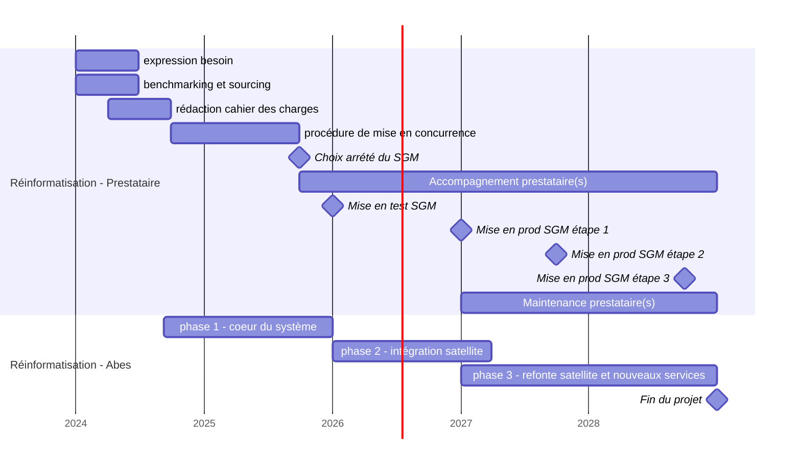
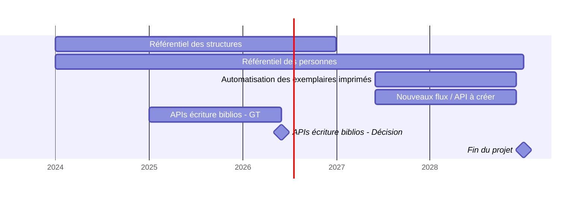
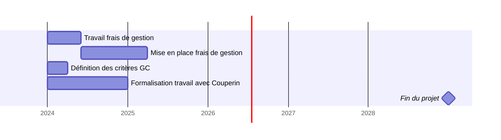
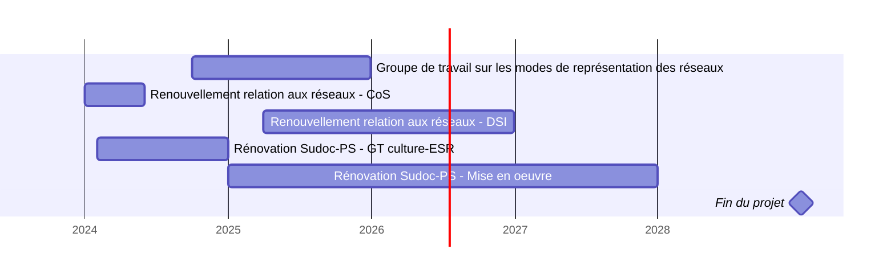
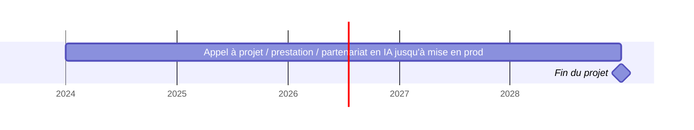
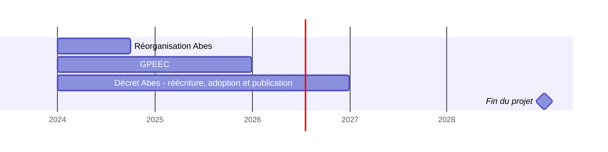

# Calendrier prévisionnel du projet 2024-2028 de l'Abes

<u>Avertissement</u>

Ce calendrier prévisionnel du [projet 2024-2028 de l'Abes](./projet2024) a été réalisé en l'état actuel de nos connaissances. Il est susceptible d'évoluer tout au long de la période en fonction de son déroulé. 

## Le système de gestion de métadonnées de l’Abes 

Le calendrier du renouvellement du SGM de l'Abes est présenté en deux parties. La première partie « Réinformatisation - Prestataire » fait référence à tout le travail qui sera réalisé entre l'Abes et le(s) prestataire(s) pour sa réinformatisation. La seconde partie « Réinformatisation - Abes » fait référence au travail des équipes Abes sur son système actuel et le travail nécessaire pour migrer vers le nouveau système.

Le détail de la répartition Abes et prestataire(s) n'est pas encore figé.

Les étapes 1, 2 et 3 du marché indiquent que nous demanderons au(x) prestataire(s) 3 livraisons successives du SGM. Le contenu de ces livraisons sera défini pendant la phase d'expression des besoins et de benchmarking. Chaque livraison aura un périmètre défini qui pourra contenir des fonctionnalités et/ou des données à faire gérer par le SGM.

Les phases 1, 2 et 3 ne sont pas détaillées dans ce calendrier. Elles font écho aux fortes dépendances expliquées dans la partie 2 du projet.

La phase 1 correspond aux étapes visant à préparer le nécessaire avec le prestataire pour un objectif d'ouverture publique du SGM en test. Cette phase inclut par exemple le travail d'installation, de configuration, de préparation et de migration des données dans le SGM à articuler ou pas avec l'accompagnement prestataire(s).

La phase 2 correspond au travail que l'on ne peut pas différer en phase 3 visant soit à activer des fonctionnalités dans le SGM qui viendront remplacer certaines applications satellites existantes, soit à connecter le plus rapidement possible les applications satellites qui ne peuvent pas être remplacées ou bien qui ont dans leurs fonctionnalités l'écriture dans le SGM. En effet, les applications satellites qui écrivent devront être remplacées ou connectées en priorité car une fois le SGM en production, les données y seront gérées. A noter que cette phase 2 est courte et dans le cas où nous manquerions de temps, des fermetures temporaires d'application seraient alors nécessaires pour pouvoir tenir notre calendrier de mise en prod du SGM.

La phase 3 est une suite logique de la phase 2 et elle correspond au travail d'ouverture aux réseaux de nouveaux services prévus en natif dans le nouveau SGM et au travail de connexion des dernières applications satellites sur le SGM, ce travail pouvant nécessiter des refontes du fait de la dette technique accumulée.

## Une « base de métadonnées » pour l’ESR

Les travaux de réflexion, par exemple sur le référentiel structures, peuvent débuter avant que la réinformatisation ne commence. Toutes les opérations liées à la mise en oeuvre de nouveautés sont reportées après la réinformatisation.

## Acquisitions de documentation électronique

Tout le travail d'évolution de la mission Acquisition de documentation électronique de l'Abes est peu dépendante de la réinformatisation de l'Abes. Il peut donc débuter dès les premières années du projet.

## Réseaux et partenaires

Le travail de réflexion et de dialogue nécessaire au renouvellement des réseaux a peu de dépendance avec la réinformatisation de l'Abes. C'est pour cette raison que de nombreuses actions peuvent commencer dès le début du projet, en particulier la rénovation du réseau Sudoc-PS.

## Renforcer la politique de Recherche et Développement

Les travaux de R&D dépendent de l'obtention de partenariats.  En cas de réponse négative, ce qui peut être posé comme principe dans le calendrier c'est le besoin de lancer d'autres actions via divers moyens comme un appel à projet, une prestation, ou un partenariat. 

L'appel à projet ia-cluster est un élément potentiellement très structurant (projet de 7 ans) qui orientera les activités R&D de l'Abes si la réponse était positive. Il est donc difficile d'écrire un calendrier avant d'avoir la réponse à cet appel à projet.

## Organisation, GPEEC, missions et évaluation

La réorganisation de l'Abes fait partie intégrante du projet d'établissement car elle occupera fortement les équipes. Cette restructuration des équipes est placée logiquement en début de projet car elle est le pré-requis pour ensuite mener le projet dans les meilleures conditions possibles. La réécriture du décret de l'Abes est également un élément structurant, donc la réflexion pourra être initiée très tôt dans le projet.
