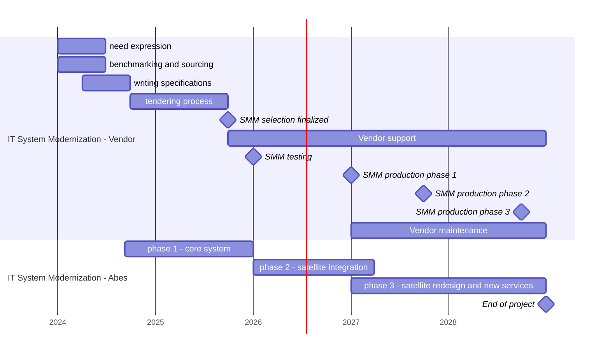
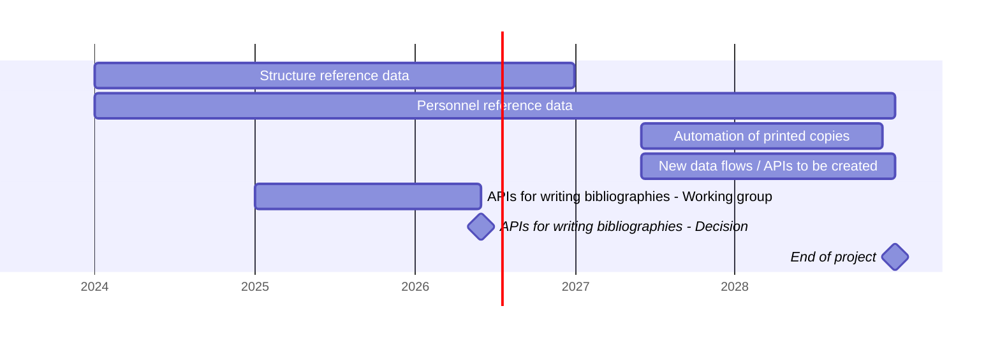
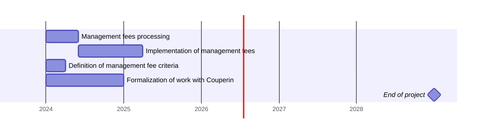
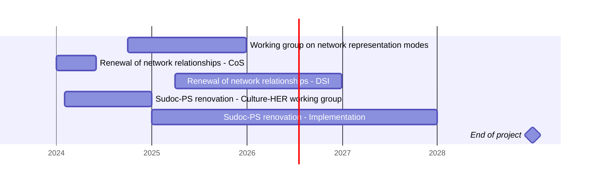
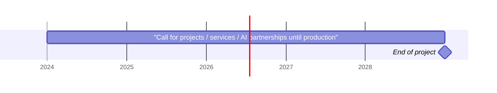
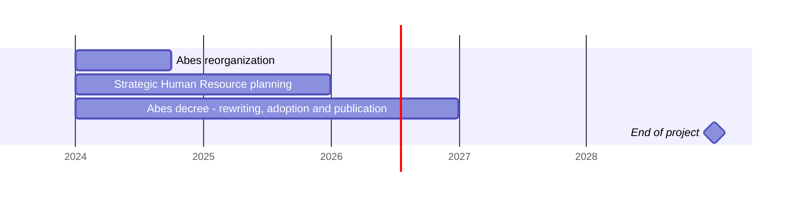

# Provisional calendar

<u>Caveat</u>

This provisional calendar for the [Abes’s 2024-2028
project](https://projet2024.abes.fr/docs/2.4/projet2024) was drawn up
based on our current state of knowledge. It may change over the period
depending on progress but makes it possible to state our initial intent.

> Reference :
> [https://projet2024.abes.fr/docs/2.4/projet2024-calendrier](https://projet2024.abes.fr/docs/2.4/projet2024-calendrier)

## The Abes’ metadata management system

The timetable for the renewal of the Abes’ Metadata Management System
(MMS) is presented in two parts:

- The first part on “Reinformatization - Service Provider” refers to the
  work to be carried out between the Abes and the service provider(s)
  for its reinformatization.

- The second part on “Reinformatization – Abes refers to the work of the
  Abes teams on the current system and the necessary work to migrate
  over to the new system.

The details of the dates and phases are provided for information
purposes only at this stage but demonstrates our intention to proceed
via several phases.

The details of the breakdown between Abes and the
service provider(s) have not yet been finalised.

Stages 1, 2 and 3 of the contracts specify that we will request that the
service provider(s) provide **three successive deliveries of the MMS**.
The content of these deliveries will be defined during the expression of
needs and benchmarking stage. Each delivery will have a set perimeter
which may contain functions and/or data to be managed by the MMS.

Phases 1, 2 and 3 are not described in this calendar. They reflect the
high degree dependency explained in part 2 of the project.

- Phase 1 corresponds to preparing everything necessary with the service
  provider with the aim of opening the MMS for public testing. This
  phase includes for example the installation, configuration,
  preparation and migration phases for data in the MMS, to be organised
  with or without the support of the service provider(s).

<!-- -->

- Phase 2 corresponds to the work which cannot be pushed back to phase
  3, aimed either at activating functions and features in the MMS to
  replace certain existing satellite applications, or to connect
  satellite applications as quickly as possible which cannot be replaced
  or whose functions include the ability to write to the MMS. Indeed,
  satellite applications with the ability to write must be replaced or
  connected as a priority as once the MMS is in production, the data
  will be managed therein. It should be noted that this phase 2 is short
  and if we don’t have enough time, temporary closures of the
  application will be necessary to be able to keep to our MMS production
  timetable.

- Phase 3 is the logical next step following on from phase 2 and
  corresponds to the work involved in opening the new services provided
  natively in the new MMS to the networks and the work involved in
  connecting the last satellite applications to the MMS. This work may
  require redesigns or the elimination of the accumulated technical
  debt.

## A “metadata base” for the HER sector

The brainstorming work, for example concerning the structures
repository, may begin before the reinformatization gets underway. All
operations related to the implementation of new features are postponed
until after reinformatization.

## Acquisitions of electronic documents

Changes in the Abes’ “Acquisition of electronic documents” mission is
not dependent on reinformatization project. This work can therefore get
underway during the first years of the project.

## Networks and partners

The brainstorming and dialogue needed to reinvigorate the networks are
not dependent on reinformatization. Thus, several actions can begin from
the very beginning of the project, particularly concerning the renewal
of the Sudoc-PS network.

## Reinforcing the Research & Development policy

The R&D work is dependent on gaining partnerships. Otherwise, something
could be included as a principal in the calendar, it were necessary to
launch other actions via various means such as a call for projects, a
service or a partnership

## Organisation, Strategic Human Resource planning, missions and evaluation

The reorganisation of Abes is an integral part of the project as it will
significantly tie up the teams. This restructuring of the teams is
logically planned for the start of the project as it is a prerequisite
to be able to then conduct the project under the best possible
conditions. The redrafting of the Abes decree is also a key element, and
thought could be given to this early in the project.
