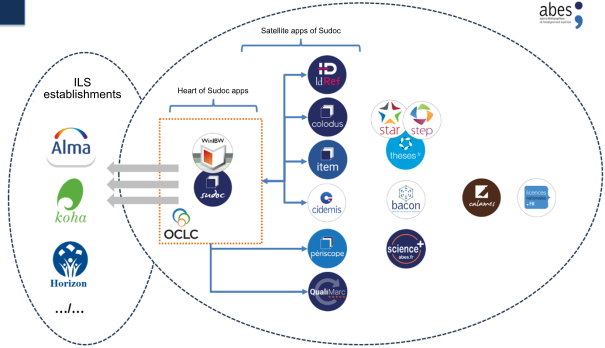

# ABES Establishment Project 2024-2028

Final translated version (2.4) of the Abes Establishment Project 2024-2028 published on 07/10/2024.

Executive summary

With this project, Abes wishes to **strengthen its role in the provision
of high-quality metadata** to higher education and research
establishments.

This general long-term objective is to be achieved for the 2024-2028
period via short-term and medium-term objectives:

- Upgrading the IT system  

- Allowing for a larger scale data policy, for more automatic processing
                           and a wider operational perimeter, meeting the new repositories of the
                           Higher Education and Research (HER) sector  

- Renewing and securing the Abes’ role in the purchasing of electronic
                                                                       documentation  

- Renewing the various aspects of the Abes’ relationships with HER
                                                                                      networks  

- Strengthening Research and Development, by focusing on
                                                                                                state-of-the-art artificial intelligence applications  

- Adapting Abes to these new aspects

## 1. The Abes’ metadata management system

Historically, there are two distinct periods in the organisation of
Abes’ management system:

- During the first half of the Abes’ life, its architecture was
  organised in a relatively centralised manner based around a product
  acquired in the market (CBS, WinIBW, PSI, APCC software suite,
  proposed by the service provider OCLC).

- For just over 10 years, to be able to extend the range of proposed
  services, part of the metadata management system has been moved to
  “satellite applications” connected to the historical system and
  developed internally.

Finally, some of our tools (Calames, STAR, STEP and theses.fr) have
their own master database and a higher degree of independence from CBS.

*Figure 1 —Simplified overview of the Abes’ IT system (2023)*

This structure has gradually become complex and cumbersome to manage. It
has accumulated a technological debt which today represents a risk to
both Abes and establishments. It also hinders the introduction of new
services and limits the agency’s capacity to renew its range of services
to more effectively keep pace with the requirements of the
establishments and their changes.

### 1.1 The framework and objectives of the move to a new IT system

A priority of this project is therefore **the renewal of the Abes’
business IT system**. On this point, efforts will be guided by the
objectives described below.

The chief objective involves renewing the range of services proposed to
the establishments by means of a system enabling them to access **more
metadata, which should be easier to use and available at a lower cost**.
The solution or solutions deployed must also enable Abes to simplify its
architecture and thereby to reduce the costs of the ownership and
operation of its IT system.

**Sovereignty concerning the data** to be contained in the new system is
a key factor of which the project must take account. This is a legal but
also a technical matter: particular attention must therefore be paid to
the capacities of the future system to enable Abes to manage the
inputting and outputting all types of data as autonomously as possible.

The aim of the project will be to cover metadata concerning paper and
electronic documentation, beyond books and magazines, within the same
system, by also incorporating commercial packages or even the metadata
for chapters and articles.

On this occasion, a reduction in the number of databases and metadata
management tools comprising the current Abes metadata management system
would be very welcome.

Concerning the data, it is intended that the new system should offer the
prospect of moving away (at least eventually), from a record logic,
encapsulated in MARC format, **to instead embrace an entity-relationship
system**. The adoption of an entity-relationship system offers several
benefits:

- Facilitating the compatibility of our data with the conceptual
  bibliographical data models currently existing, including as a
  priority IFLA-LRM, as a reference for bibliographic information

- Proposing what would in principle be a more flexible and upgradable
  representation of the data managed within the system

- Facilitating the exportation and presentation of data with a view to
  it being reused by third parties, including outside the libraries
  sector

This issue concerns the management of the data by the system itself as
well as the export and circulation of data.

**The objective of managing the overall costs related to the possession
of the new system** during the project and subsequently, in its
day-to-day operational phase, is another requirement to be considered.
This objective includes taking account of the risks presented by the
management of the system, much of which is conducted internally: Abes
will therefore seek a system currently existing in the marketplace,
guaranteeing the completion of the project within the set deadline, with
effective cost control. This factor will also help simplify and improve
the clarity of the information system.

This key criterion of matching expressed needs to the real possibilities
offered by solutions currently available in the market must be adapted
to take account of several factors:

- We must not exclude the possibility of performing additional
  development work or having such work performed, which would make it
  possible to meet needs not initially covered by the envisaged system.

- Great importance will be given to the Abes’ ability to use the system
  in complete autonomy, particularly but not exclusively for the
  comprehensive management of metadata and to extend its functions and
  features to meet the specific requirements of its users, for example
  by favouring a system proposing a very wide range of *Application
  Programming Interfaces* (APIs).

- A solution with a free software licence could provide real benefits in
  terms of autonomy and will be the subject of specific investigations.

<u>*Criteria for success*</u> 

- An initial tranche of the management system, yet to be defined, could
                               be in production in 2027 to allow for the deployment of new services
                               in the closing period of the project

- The metadata for printed and electronic resources (ebooks, magazines,
  packages) are managed natively by the new metadata management system

<u>*Extended criteria for success*</u> 

- The new metadata management system can handle entity-relationship data

- The new metadata management system incorporates metadata at an article
  and chapter level for electronic resources

### 1.2 A web interface policy

Some of the interfaces proposed by Abes will be updated as part of the
change of metadata management system. **This change of professional and
public interfaces is a key objective of the new system.**

For the creation, modification, viewing and deletion of data by the
networks, Abes must:

- Move to full web mode and simplify interfaces for production “on a
  unit basis” to facilitate cataloguing within the establishments. Gains
  are expected both for the management of the establishments’ IT
  resources but also when it comes to training and support needs,
  enabling those establishments wishing to do so to diversify their
  internal organisation for the management of unit-based cataloguing
  data

- Provide experts at the establishments with greater autonomy via the
  interfaces to carry out bulk modifications, to prepare data batches,
  and to more easily export and import data

For the public interfaces associated with the Abes’ new metadata
management system, and for the public interfaces of the applications we
will continue to manage outside the updated metadata management system,
the following objectives have been set in a decreasing order of
priority:

- Modernising the public research interfaces to keep pace with the state
  of the art, with a particular focus on accessibility

- Displaying a consultation interface built on data organised on an
  entity-relationship basis, at least during the trial phase, at the end
  of the period

- Enabling those establishments wishing to do so to autonomously
  personalise a research interface covering a data perimeter specific to
  them

<u>*Criteria for success*</u> - The public portal for the metadata management system is an RGAA-compliant web interface possessing security approval  

- The cataloguing interface of the metadata management system is a web
                                                                                                                                                      interface proposing forms to create or modify data on a per-unit basis
   A new batch or unit-based data administration service is proposed to
                                                                                                                                                      experts within the networks

                                                                                                                                                                                                                                                                                                                                                                                                                                              **<u>*Extended criteria for success*</u> **

- The public portal for the metadata management system offers
  establishments a back office allowing for the personalisation of the
  web interface and the optimal use of data  

- A demonstrator proposing a consultation interface making the most of
                                             the added value of entity-relationship data is open to the public

### 1.3 An Open Source strategy

> Since the previous facility project, Abes has focused its development
> policy on Open Source solutions. Thus, all source code for the new
> projects initiated by the establishment should be published on an Open
> Source basis on the GitHub platform. This strategy offers numerous
> benefits:

- Improvements to the quality and security of the software: as the code
  is open source, Abes is totally transparent concerning its code
  production vis-à-vis its partners  

- Possibility to reuse and share software components  

- Possibility to join an existing Open Source community

Abes will bolster this strategy further during the next facility project
and may potentially extend it, particularly regarding the choice of
resources, including the replacement of the metadata management system.

Abes does not rule out providing human or financial resources in order
to improve the Open Source software it uses but particular attention
will be paid to the notion of forking, (copying a version of the code
for an application with a view to modifying it to make a specific
version for the agency). Indeed, using a fork of the source code may
significantly increase the costs of ownership, when controlling these is
a key priority.

<u>*Criteria for success*</u> 

- When choosing an Open Source software solution for the metadata
                               management system, Abes actively participates in the Open Source
                               community* *

- When choosing an Open Source software solution for the metadata
  management system, Abes does not fork the software: the features and
  functions developed are included in the software’s roadmap  

- Any plug-in added to the metadata management system, or any satellite
                                                              application developed by Abes has code for which the licence is Open
                                                              Source.

### 1.4 An API strategy

The “API first“ strategy adopted by Abes consists of primarily offering
machine-oriented services to meet the following needs:

- Decorrelation between the visual aspects (user interfaces) and
  non-visual aspects (processing of data, calculations and algorithms)

- Interoperability with the HER sector’s IT systems

- Freedom in the choice of languages used for the processing or the
  interfaces making it possible to use these APIs

- Security: the data is only accessible via pre-secured APIs

The future metadata management system must natively incorporate not only
user-focused services but also and above all open APIs in keeping with
the latest developments.

The satellite applications (both present and future) will be based on
this state of the art, either using the metadata management system’s
APIs or by themselves proposing new APIs.

All the APIs developed by Abes will be published and documented at
[https://api.gouv.fr](https://api.gouv.fr/). The services (present and
future) organised around the future metadata management system will be
based on the same principles.

The APIs proposed by Abes to the networks are currently read only. The
future APIs made available to the networks will also, from the design
stage onwards, provide data creation, modification and deletion
functions (known as “[*API CRUD*](https://fr.wikipedia.org/wiki/CRUD)”).
These new functions will be proposed natively by the new metadata
management system and all new applications intended to write such data
in the Abes’ systems will have API CRUD.

These APIs will require authentication on the machines seeking to access
them, making it possible to secure the service provided, to manage it,
and offer services adapted to each user category.

<u>*Criteria for success*</u> 

- At the time it goes into production, the new Abes metadata management
                               system has publicly documented APIs

- All new satellite applications developed by Abes has publicly
  documented APIs available at [https://api.gouv.fr/](https://api.gouv.fr/)

- The Abes’ metadata management system proposes APIs in write mode

- Before the end of the project, a service for the correction, reading,
  modification and deletion of entries is established with the APIs 

- During this project, a study note lays down the conditions necessary
                                                                     to the implementation of an API for the creation, reading,
                                                                     modification and deletion of bibliographical data

<u>*Extended criteria for success*</u> 

- APIs for the creation, reading, modification and deletion of
                                        bibliographical data are proposed to the establishments

### 1.5 The upgrading of the metadata management system as a central aspect of the project

Currently, numerous services based on data from Sudoc are proposed to
the Abes’ networks. These services operate either via applications
proposed natively by OCLC (Sudoc public interface, regular transfers,
cataloguing *via* WinIBW) or by IT applications, referred to above as
“satellite applications”, developed and operated by Abes such as IdRef,
Colodus, ITEM, Cidemis, Periscope, QualiMarc, Paprika, or micro-web
services.

These applications handle data from the Sudoc on a read or write basis,
with Sudoc being the master database. The read and write operations
performed by the satellite applications are carried out using a Java
library developed by Abes, making it possible to communicate with the
Sudoc core via an undocumented ad hoc connection.

Regarding the renewal of existing services and the change of the
metadata management system, several cases should be considered:

1.  An existing service provided by a satellite application, which will
    be natively integrated within the new metadata management system

2.  An existing service provided by a satellite application which cannot
    be integrated within the new metadata management system

3.  A new service directly provided by the new metadata management
    system

In the first case, the renewal of the Abes’ metadata management system
will make it possible to completely replace the application by functions
included natively in the new system. It should be noted that a
replacement of this type may bring about improvements, regressions or
require a new way of providing the service. The complexity of this
scenario applies above all in supporting the change. The Abes will seek
in as far as possible to replace its satellite applications by the
metadata management system to increase the return on investment for this
change of system.

In the second case, the satellite application must be retained, and it
will then be necessary to replace the proprietary communication layer
(the Java library) by a communication layer based on the open APIs of
the new system. This operation is risky and costly from a technical
viewpoint. Indeed, a data model sufficiently far from the current model
may substantially modify the internal logic of the application. And some
applications have built up a significant technological debt requiring
not only modifications to the communication protocol but a complete
redesign.

Finally, in the last case, the new services will be natively proposed by
the metadata management system’s functions and features. The launch of
the services will essentially require training, support and
communication as with the launch of any new service proposed by Abes.

It is only via these three scenarios that existing or new services will
be proposed to Abes’ network throughout the five years of this facility
project. The services concerned, in addition to new public interfaces or
services concerning the metadata database for the HER, will therefore be
available once the change of metadata management system has been
completed.

A high degree of dependency therefore exists between the moment this new
system enters production, and the moment new services listed in this
project may be proposed.

**The renewal of the metadata management system should be considered as
the backbone of Abes’s 2024-2028 project.**

<u>*Criteria for success*</u> 

- At least two existing satellite applications are replaced by the
                               metadata management system

- At least one existing satellite application is connected to the
  metadata management system via its APIs

- At least one new service, not currently provided by Abes, is based on
  the functions to be included within the metadata management system

-

## 2. A “metadata base” for the HER

The main mission of Abes is to provide a collective catalogue of
documentation proposed by higher education research establishments:
despite substantial efforts, this has been a difficult objective to meet
despite the mass of electronic data, and the establishments’
expectations on this point are very high.

Unit-based cataloguing is the main method today proposed for adding to
the collective catalogue on an ongoing basis. This form of use will
continue alongside the massive importation and updating of batch data.
The future system should facilitate these three processes.

A catalogue is not just a data reservoir. It should also show the reader
which resources are accessible from which library, and whether this is
in physical or electronic form. This resource location function must be
improved both for physical and digital resources, by automating
information flows between the systems of the establishments and of our
partners and the Abes’ system.

### 2.1 Easier identification: data volumes, flows and centralisation

Bibliographical identification is an important activity in libraries,
even if their metadata is increasingly being circulated outside their
catalogue. As a national operator for the identification of higher
education collections, **Abes needs to increase the quality of the
imported data and facilitate the creation of metadata** with the
intention of significantly reducing the cost of processing the resources
required by the establishments, while at the same time contributing to
the dissemination and use of the metadata they circulate. It must be
possible to base this circulation policy on work to improve quality
concerning collections and themes which are relevant for libraries and
organisations in the HER sector.

The identification of electronic resources is becoming increasingly
costly in the Abes’ databases due to the diversity and quantity of the
resources to be processed. A consequence of their exponential increase
has been to make tracking them increasingly complex and time-consuming,
with the recency of the bibliographical information sometimes paying the
price for this in addition to the increasing difficulty in managing
access to it. The increase in the number of identification databases
currently proposed by tAbes (Sudoc, BACON, Science+), and the complex
interactions between them considerably hinders the management of access
and the quality of identification, with the metadata being dispersed and
poorly linked. 

The renewal of the Abes’ metadata management system seeks to achieve a
convergence of this identification data, which will improve dialogue and
secure interoperability between all of its metadata. De facto, it will
guarantee greater fluidity when exchanging information, by facilitating
a concentration of data flows which are today dispersed among satellite
applications. This convergence will have the benefit of:

- Helping with identification

- Reducing cataloguing time

- Facilitating the monitoring of access to electronic resources, which
  is made complex due to the changing perimeter of commercial
  collections

- Improving the visibility of French scientific output

- Contributing to the coherence and harmonisation of the data displayed.

Abes can then rightly claim to be a **supplier of consolidated data for
Higher Education establishments**. 

For this new facility project, Abes would also like to introduce **a
more ambitious import policy**, particularly for electronic documents.
Although systematic and comprehensive imports are a theoretical
objective, a realistic policy must be pursued, in consultation with the
HER establishments and the Couperin Consortium, with its prioritisation
work based on various criteria (French-language output, publications by
French authors, the usage of electronic documentation, etc., whether
this concerns the identification or reuse of resources). This policy
should encapsulate the various levels of granularity of metadata
(e-books and chapters of e-books, magazines and articles, packages,
etc.) without forgetting the theses for which Abes plays a national
role.

Regarding imports, thanks to the experience acquired in the processing
of metadata, Abes would like to **extend its metadata improvement
service for publishers and distributors**, according to the reuse
requirements identified (including in particular those of stakeholders
promoting the opening of research metadata).

Furthermore, despite the currently high preponderance of electronic
documentation, this determined import policy must also concern printed
resources. The cataloguing of printed resources still assumes a
significant percentage of the Sudoc at around 250,000 printed notices, a
figure they should consider significantly reducing if they wish to
reduce processing times on their site, thanks to the creation of new
imports.

Based on the capacities of the future Abes metadata management system,
the facility project will seek to:

- Offer higher volumes of metadata, whether this concerns commercial
  packages or printed material acquired by the establishments 

- Propose more thorough and systematic flows between systems:

    - It is necessary to improve interactions between local IT systems
      (documentary resources, open archives, the ERMS systems of the
      establishments or of Couperin), with the intention of facilitating
      the exchanging of data and its use by third parties. This work will
      be based on the API policy described above

    - Specifically concerning localisation flows, the task is to
      generalise and standardise the flows set up in recent years for some
      of the e-books. Abes would like to propose them to all its networks
      and widely extend them to printed documentation (see 2.4 above - API
      Strategy). The objective is therefore to facilitate the automatic
      synchronisation of local systems with the Abes’ management system
      based on metadata supplied by the establishments with the aim of
      avoiding double inputting and of guaranteeing better coherence
      between local catalogues and the national databases

<!-- -->

- Reduce dispersion and processing costs concerning metadata:

    - Work on the convergence of metadata which is currently dispersed (in
      Sudoc, Science+ and BACON)

    - Allow for easier management via the Abes’ management system:
      activation of packets and monitoring of their content, to
      automatically recover information via the establishments’
      documentary solutions

<u>*Criteria for success*</u>

- The selection of the publishers’ collections included in the Abes’
  management system is conducted in liaison with the establishments and
  the associations representing them: a roadmap and a calendar are
  available

- Tracking of the content of commercial packages and their
  identification takes place automatically 

- Bibliographical imports account for more than 50% of the creative work
                                            used within the system by the establishments by the end of the period

### 2.2 Defining a data policy

In all discussions with Abes’ networks, the question of the quality of
the data circulated by Abes often crops up. It is particularly difficult
to respond to this, as the notion of quality is linked to questions
concerning usage, identification context, the type of collections
described, and the audience benefiting from these resources, etc. As the
definition of quality varies according to each establishment’s needs,
Abes cannot skimp on work which would enable each party to assess the
quality of data received, to facilitate its use and reuse.

Furthermore, although Abes intends to continue its efforts to improve
the metadata entered its database, it would be a mistake to hope to
improve it for all imports, which we also envisage significantly
automating and increasing: Abes and its partners must therefore **define
and implement a differentiated quality policy**. This means collectively
defining for which entities and for which types of information
additional investment is considered necessary. Data for French research
level publications and Open Access publications, and the data of the
heritage collections or that likely to be used in national digitisation
programmes could be specially targeted for example. This could also be
the case for data relating to a certain number of repositories and
benchmarks used in the HER sector, by people and organisations involved
in research.

Once this quality policy has been defined, it is necessary to be able to
apply it and measure quality, which means introducing detailed
indicators. These indicators may or may not be aggregated to create one
or several overall scores, making it possible to provide an indication
of the reliability or reusability of the proposed metadata.

This categorisation work will be accompanied by **an explanation of the
circulation policy and reuse rights regarding Abes’ data**. This work
particularly concerns the concrete methods for circulating the data
(publication of collections of data and APIs for example).

<u>*Criteria for success*</u> 

- Abes has a public data quality policy accompanied by indicators 

- Abes has implemented a categorisation system for its data,
                                                                                                particularly by means of an overall score allocated to the metadata
                                                                                                concerned 

- Abes has a display policy for its data 

- Abes has updated its policy on the circulation and reuse of its
                                                                                                                                                   metadata.

### 2.3 Agents’ repositories contributing to the simplification and clarity of the HER sector

Abes and the documentary networks have a long history in creating
authorities’ records, including the authors and authorities associated
with the identified publications. However, for several years now, this
data has taken on strategic importance, leading us to collectively
consider it from a new angle: this concerns more solidly structured
repositories interacting with one another, based on unique, long-term
identifiers, not only for documentary purposes but also for the numerous
other purposes of stakeholders in the HER sector.

Its increasing use means that it is now necessary to work with greater
acuity, focusing not only on the relationship between existing
repositories (IdRef, ORCID, etc.) and the quality of the data supplied
but also the creation of new repositories, particularly those of
different structures, whose requirements are amply demonstrated within
the HER sector.

#### 2.3.1 Peoples

Work has been carried out for a long while with IdRef with this in mind,
based on the solid foundations of sharing, quality and the number and
variety of source producers (Sudoc, Thèses, Calames, Cairn, Persée,
CanalU, ScanR) and Swiss and Belgian catalogues, etc. As such, it has
become a key identifier for the “personal authorities” in the HER
sector.

The quality of the work produced by Abes in recent years on IdRef is
result of a policy of openness, dissemination and curation combining
several aspects:

- interaction between automated and manual intervention work

- the diversification of sources, getting closer to the point at which
  the data is generated,

- and the involvement of data producers, thanks to the attention paid to
  their usage scenarios and to the range of easy-to-use production
  interfaces.

The interaction between IdRef and ORCID which has been widely extended
since 2019 with the creation of the ORCID France consortium and the
automatic alignment of data at a large scale must be continued to
encourage the simplification and planning expected in and between HER
establishments. This work must also be extended to find the best
possible compromise between autonomy for researchers, the role of the
institutions and the ORCID’s.

#### 2.3.2 Structures

Furthermore, to ensure national and international clarity and visibility
regarding the research sector in France, the multidimensional effort
made by the people involved must extend to **organisations and
structures in the higher education and research sector**. It entailed
the same questions concerning the interaction between three levels:

- A local level, closer to usage scenarios and operators in the field

- A national repository applicable to users

- And an international repository like the *Research Organization
  Registry* (ROR).

This policy is currently being defined by the Ministry for Higher
Education & Research. Abes is particularly requested to provide its
input concerning **the definition of the metadata system, the management
of metadata and the organisation of the networks of contributors**.

Regardless of the nature of the agent concerned, (whether a Person or
Collective Agent), this movement, which seeks to adapt data management
to allow for more generalised use throughout the education sector,
supports the documentary establishments ‘policy, the work of which is
now closely associated with the management of the institution and
support for teachers and researchers.

#### 2.3.3 Agents entities

The IFLA-LRM conceptual model is based on a series of repositories
(Agent, but also Work, Expression, Location, Concept, Time, etc.) which
are interconnected. Changes in the metadata models managed by the
documentary sector to embrace this general concept of entities and
relationships is an objective shared by Abes and numerous establishments
in the documentary sector, in France and abroad.

Our expertise concerning People, which is particularly demonstrated with
the success of IdRef, and the level of demand expressed in the HER
sector for the ability to benefit from repositories for the Structures
have encouraged us to make a specific effort focusing on agent
repositories. This work is therefore **a concrete step for Abes on the
road from a bibliographical catalogue to an entity-relationship data
model**.

From the perspective of guaranteeing the quality of a Repository for
People and Structures useful to the HER sector, Abes’ objectives in this
facility project are therefore:

- To improve the quality and comprehensiveness of the data for
  researchers’ repositories circulated by Abes

- To help increase French researchers’ ORCID numbers in the ORCID
  database and in Abes’ databases, by helping establishments to support
  their researchers 

- To help increase the number of French organisations and structures in
                     the ROR database and in Abes’ databases by helping establishments to
                     support their researchers 

- To encourage the dissemination of Persistent Identifiers (or PID)
                                                particularly those of repositories for persons and Structures in the
                                                establishments’ IT systems and in the documentary collections
                                                available in the HER sector, to improve visibility of researchers’
                                                scientific output

<u>*Criteria for success*</u> 

- The number of ORCID identifiers of French researchers increases on
                               average by 25% each year and Abes aligns them systematically with
                               IdRef identifiers.

- An indicator making it possible to measure the annual change in
  ORCID adoption is set up based on the public ORCID dump

- Abes has a service enabling HER establishments authorised to issue
  doctorates to align the data from Abes repositories with their own
  data

- As contractual agreements are established between Establishments and
  the State, Abes provides 100% of HER structures with a ROR aligned
  with IdRef 

- Work to create a Structures repository results in the publication of a
              metadata system specific to this repository based on established uses
              and the introduction of governance for this data

<u>*Extended criteria for success*</u>

- With a view to creating a metadata management system able to manage
  entities, Abes is circulating Agent entity repositories (People and
  Authorities) compliant with the IFLA-LRM conceptual model

- Abes contributes to organising a community of users and producers
  based on a repository for structures within the HER sector

## 3. Acquisitions of electronic documents

It is vital that this activity conducted in collaboration with Couperin
though without being a mission enshrined in the Abes’ articles of
association of this stage, should be secured for the coming years. These
efforts to secure the activity will be carried out in collaboration
between Abes, Couperin, and Ministry of Higher Education and Research
(*Ministère de l’Enseignement Supérieur et de la Recherche* – MESR). 

### 3.1 Ensuring the sustainability of the mission 

It is vital to secure the **economic model** for this activity for Abes,
particularly by reviewing the management cost model. Monitoring the
activity of the 15 current order grouping contracts will require
approximately three additional FTE positions, while the complexity of
the cases concerned and the support requirements, particularly
concerning the legal aspects of negotiations, are increasing. The
management cost model will be reviewed, with the twofold objective of
reconciling greater equity between the participants and realism, both
regarding the cost of the service and the added value contributed to the
whole ecosystem.

At the same time, Abes must work with the supervisory authority **to get
this mission officially recognised in its articles of association**.

### 3.2 Setting the criteria for “national contracts” 

Abes is today analysing requests to support contracts on a case-by-case
basis. A support policy based on explicit criteria is today necessary to
secure the work of Abes and that of its partners. As an operator of the
Ministry of Higher Education and Research, the Abes’ task is to support
“national contracts” which should be defined working with Couperin and
the supervisory authority. 

It initially appears that these criteria may be quantitative. They may
also be qualitative, for example for groups which fall within the
state’s political strategies regarding documentation or support for
scientific publishing. The task is to draw up an objective common basis
for analysis, making it possible to decide whether or not to support a
contract and to **rationalise the scope of the Abes’ participation**.

### 3.3 Defining the Abes’ functional intervention perimeter 

The increasing complexity of the contracts noted above has gradually
blurred the dividing line between negotiation and contracting over the
last 10 years. Couperin and Abes have gradually adapted their day-to-day
operations to this situation and Abes now automatically participates in
negotiations including supporting a group ordering operation.

This pragmatic adaptation will be more explicitly re-examined by both
partners to jointly come up with a new operating model making it
possible to make better use of each party’s skills. 

<u>*Criteria for success*</u> 

- A new management cost model is approved by the Executive Board and
                                                                                  implemented 

- The sum received corresponding to these new management cost model
                                                                                               allows for the recruitment of 3 staff for the current perimeter of 15
                                                                                               contracts and the model allows for the changes in human resources
                                                                                               necessary to a possible increase in activity

- Abes and Couperin Executive Boards approve a basis for analysis making
  it possible to assess the appropriateness of Abes supporting a
  contract

- Abes and Couperin Executive Boards approve a basis for the continuous
  analysis of the contracts

- A scoping document describing the negotiation and contracting process
  for a contract and explaining the relationship between Couperin’s work
  and that of Abes is approved by both organisations’ Executive Boards

## 4. Networks and partners

For 30 years, Abes has organised documentary networks and has gradually
introduced several solutions to support establishments for all aspects
of this joint work.

These solutions may take the form of:

- Assistance, considered in the widest sense, with for example the
  introduction of a ticket management system or assistance provided for
  documentary design projects.

- They may also include the organisation of an activity-specific
  community, with example discussion lists, Abes Days or the publication
  of the *Arabesques* magazine.

- They may also concern support for joint work, for example concerning
  training or working groups. Finally, they may involve financial
  support, for example for the Sudoc PS network or the retrospective
  cataloguing of collections.

With the changes it brings about, this facility project will have a
**major impact not only on Abes itself, but also on partner
establishments**, particularly due to the pending renewal of our
metadata management system and the focus placed on volumes and data
flows.

The move towards new identification methods, via more user-friendly web
interfaces, with a new data model in mind, will require major
adaptations by everyone involved and specific support from Abes
regarding its networks.

Taking a fresh look at all of these aspects is therefore a necessity but
also an opportunity.

### 4.1 Renewing opportunities for strategic dialogue

In its report of May 2022, the HCERES recommended turning the Abes
Scientific Committee into a **Strategic Steering Committee (SSC)**,
bringing together the partners and operators in the Scientific and
Technical Information (STI) sector. This 2024-2028 project acts on this
recommendation, and considers, along with the HCERES, that this new body
will make it better able to combine strategic investigation work with
the decision-making work of the Executive Board. The SSC should become a
fully-fledged body within the establishment, identified as such in the
establishment’s articles of association

This institutional aspect must be accompanied by the introduction of new
means of dialogue and co-construction with the establishments. The task
is to provide the opportunities necessary to joint strategic
brainstorming and for the establishments to express their needs, to help
Abes give thought to its own projects and their future developments.
These measures will be proposed to the Executive Board, and regularly
reassessed to guarantee their effectiveness over the long-term.

<u>*Criteria for success*</u> 

- An initial meeting of the SSC is held in 2025 at the latest

- A report is presented to the Executive Board halfway through,
  concerning the strategic dialogue measures introduced

### 4.2 Developing a programme of technical relationships

The renewal of the Abes’ metadata management system and the importance
accorded to the issues of technical data flows and use of repositories
in the HER Information Systems as part of the 2024-2028 project require
specific support.

A new **“technical” network** has now become necessary. It should allow
for dialogue with colleagues who administer and develop the IT systems
of documentary establishments within the HER sector. This dialogue is
even more important as the perimeter of the software which manages
metadata within these establishments is increasing and now often
includes digital libraries, bibliometric resources or discovery tools
separate from the library’s internal management software. Encouraging
the dissemination of the Abes’ identifiers and data in these documentary
ecosystems therefore makes it necessary to formally define technical
interactions, which are today too empirical and dispersed.

This new network should also make it possible to take account of the
needs of communities who, outside the documentary sector and in
relationship with it, could benefit from the metadata we collectively
produce. This is particularly the case for data used to manage higher
education establishments, which is not frequently used today in higher
education and research information systems.

Abes is therefore looking to build and maintain a community of mutually
beneficial relationships between the establishment and the
above-mentioned technical stakeholders (administrators or developers of
software solutions) in their capacity as key users and often influencers
in the use of digital products and services within their establishments.

This programme to support the data flow and API policy will be built
around the following aspects:

- Developing awareness-building and commitment-building activities among
  these audiences to facilitate the use of the Abes’ data services

- Proposing training resources and documentation to facilitate learning
  and familiarity with the proposed tools

- Ensuring that we meet the establishments’ expectations and technical
  needs by regularly taking stock of their requirements

- Encouraging the creation of a community of practices to maintain the
  sustainable use of the proposed data and technical services, and to
  ensure that these change in line with requirements

<u>*Criteria for success*</u> 

- Abes has a network devoted to technical matters and organises a
                               community comprised at the very least of clubs for users and
                               administrators of software solutions. A mid-stage report and end of
                               project report provide an assessment of this programme’s activities 

- Abes supplies detailed documentation concerning its data
                                                                                                    administration and exploitation resources

### 4.3 A redefined Sudoc PS network

The enduring specific characteristics of the resources and the wealth of
partners involved, concerned not only by libraries in the HER sector but
also libraries and documentation sectors operating under the auspices of
the Ministry of Culture, or of other ministries or local authorities
make the Sudoc PS network a key factor in its own right.

We have noted the difficulties in managing this network, which is based
on very few people, and for which the geographical structure and roles
have not been reviewed for a long while. The higher education
establishments supporting the regional centres are now struggling to
assume the duties associated with this mission.

Brainstorming concerning the support, management, functional perimeter
and objectives of this network will be conducted in 2024 involving the
stakeholders concerned, whether these come under the Ministry of Higher
Education or other supervisory bodies, in particular the Ministry of
Culture. This work, which will also take account of *the Plans de
Conservation Partagée des Périodiques* (Joint Conservation Plans for
Periodicals) provides an opportunity to redefine the network’s common
objectives, to consider the means and resources necessary to make it
work, and to redefine its organisation and management.

<u>*Criteria for success*</u>

- A structure for regular dialogue and a joint inter-ministerial
  management body are established 

- The economic sustainability of the network is guaranteed 

- The new operational framework for the Sudoc PS established during this
                                                                                             project defines the criteria for success for this work

### 4.4 Reinvigorated relationships with the networks

Regardless of the communities served, whether these are entirely new,
redefined or inherited from the historical perimeter, **Abes must give
thought to the way it interacts with and supports its networks** by
producing an overview of these activities. This work is necessary for
two main reasons:

- Firstly, because this facility project itself, particularly because it
  focuses on volumes and flows of metadata, certainly has an impact on
  our entire ecosystem. As an example, we should note that the
  management and identification of electronic documents are often
  conducted in establishments, between contract managers, IT system
  managers and cataloguers and that the establishments may have
  different management methods and requirements, for example those of a
  heritage-related nature with collections chiefly in the Human Sciences
  field, those which are multidisciplinary and medium in size, or major
  establishments specialising in Science and Technology.

- Secondly, the technical and organisational aspects of our relationship
  with the establishments have not been reviewed for a long while.

It therefore appears necessary to **improve the efficiency of the
proposed systems** and to **improve autonomy for those dealing with
us**. Special attention shall be paid to the needs for support directly
associated with the renewal of the Abes’ metadata management system
during the period considered.

This issue concerning changes to the support systems proposed by Abes
includes:

- The means of communication and stimulation of dialogue within the
  networks

- The assistance documentation and related aspects

- Online or attendance-based training and the necessary partnerships
  with training bodies

<u>*Criteria for success*</u> 

- A document defines the Abes’ overall strategy regarding the
                               organisation of communities and relationships with users 

- Work to redefine the range of training is carried out in partnership
                                                                                         with training bodies in this sector, with the aim of providing greater
                                                                                         autonomy for users 

- An incident ticket management system is set up, which should be easy
                                                                                                             to use and more satisfying for users than the current system. The cost
                                                                                                             of using the service for Abes is reduced

-

## 5. Reinforcing the Research and Development policy (R&D)

For several years, the Abes laboratory has been considering and
conducting work in the field of artificial intelligence (AI). Although
the Abes’ role is not to conduct research per se, the agency must
nevertheless clarify and facilitate the contribution made by technology,
and AI in particular, for the processing, curation and improvement of
large quantities of metadata, and the creation of new resources intended
to bring professionals greater autonomy and to make them more efficient
in the performance of certain activities, in addition to task
automation.

Abes will ensure that these studies and prototypes meet short or
medium-term project development targets: once interest in a market of
critical size has been established, the creation of a range of products
and services derived from the R&D process must be transferable at scale
and within the processes and resources proposed to all partners.

Abes will conduct this R&D work as part of partnerships with:

- Organisations engaged in similar R&D activities using AI in the
  documentary sector

- Partners making it possible to confirm usage scenarios, particularly
  establishments which are subsequent users of the Abes’ products and
  services, which, among other things, may contribute to analysis
  requirements, the preparation of data or the evaluation of the
  projects in which they are stakeholders

- Private partners contributing their skills, their workforce and
  industrial capacity

Two major aspects will be the focus of the work conducted as part of
this project:

- Applying AI to the data generated by Abes with the aim of opening both
  source data, data resulting from processing and models used to allow
  for greater reuse

- Proposing AI assistance services to users of the software made
  available by the agency

This AI-focused R&D activity will result in four types of deliverables
and actions:

1.  Transforming and improving the data managed by Abes

2.  Equipping the resources made available to professional users with
    decision-making aids or even automation features 

3.  Sharing these features in the form of APIs, open models and open
                                                        code to enable our partners to use them on their own data and in
                                                        their own context 

4.  Proposing our data as third-party AI inputs to improve large models
                                                                             (LLM)

<u>*Criteria for success*</u> 

- Two thirds of the studies and prototypes set up result in an
                               application tested by our partners outside Abes 

- Half of the applications tested enter production

- The reputation of the Abes’ R&D work is enhanced in the documentary
  sector and in the higher education and research sector 

- The measurement of the reuse of our data and models 

- The measurement of the satisfaction levels of the users of our
                                                                                                               resources after the introduction of the decision-making and automation
                                                                                                               functions

##  6. Organisation, Strategic Human Resource planning, missions and evaluation

Once the facility project has been approved and its objectives set, Abes
must organise to implement the chosen policy. This forms part of the
project, requiring resources and must take place within the first stage
of the project.

We must work on the collective organisational aspects and by the second
half of 2024 **introduce a new organisational structure** for Abes,
adapted to the new needs and objectives identified by the facility
project. We must also work on the introduction of **a Strategic Human
Resource planning**, based on an analysis of the current skills of the
teams and the requirements identified in the establishment project. A
training plan, reflecting the Abes’s need for skills as expressed in the
2024-2028 project will also be necessary.

Successful tracking of the satisfactory performance of the facility
project also needs to be incorporated within the Abes’ organisation and
the criteria and methods for the assessment of the agency’s activities
necessary to its management will need to be included in all actions
related to the project. This evaluation includes environmental
objectives, particularly concerning two points: digital sobriety and the
overall carbon footprint for the establishment

This 2024- 2028 project partially corresponds to a change in the
establishment’s activities. Some activities, such as the acquisition of
electronic documents, have been practised for a long while, but need to
be put on an official basis and thus secured. Others, such as work on
Agents’ repository data, circulated throughout the whole of the HER
ecosystem, are new missions taken on in recent years by the libraries
and by the Abes.

Therefore, during the 2024-2028 period, the task is to express the
facility project and its main aspects in a **modified decree**, in terms
of missions extending beyond the project period.

<u>*Criteria for success*</u>

- A new organisation chart is produced in 2024

- A document presenting the Strategic Human Resource Planning for Abes
  is produced, combined with a training plan 

- A strategic Steering Committee is set up 

- The Abes’ decree is modified, particularly article 2 concerning the
                                                                                        establishment’s purpose

- Abes has a management chart listing the main indicators making it
  possible to manage the establishment’s policy 

- During the period covered by the project, Abes has improved its
                                                 digital sobriety, particularly concerning the electricity consumption
                                                 of its IT infrastructure 

- Abes has improved the establishment’s overall carbon footprint

## 7. Provisional calendar

This provisional calendar for the [Abes’s 2024-2028
project](https://projet2024.abes.fr/docs/2.4/projet2024) was drawn up
based on our current state of knowledge. It may change over the period
depending on progress but makes it possible to state our initial intent.

> Reference :
> [https://projet2024.abes.fr/docs/2.4/projet2024-calendrier](https://projet2024.abes.fr/docs/2.4/projet2024-calendrier)

### 7.1 The Abes’ metadata management system

The timetable for the renewal of the Abes’ Metadata Management System
(MMS) is presented in two parts:

- The first part on “Reinformatization - Service Provider” refers to the
  work to be carried out between the Abes and the service provider(s)
  for its reinformatization.

- The second part on “Reinformatization – Abes refers to the work of the
  Abes teams on the current system and the necessary work to migrate
  over to the new system.

The details of the dates and phases are provided for information
purposes only at this stage but demonstrates our intention to proceed
via several phases. The details of the breakdown between Abes and the
service provider(s) have not yet been finalised.

Stages 1, 2 and 3 of the contracts specify that we will request that the
service provider(s) provide **three successive deliveries of the MMS**.
The content of these deliveries will be defined during the expression of
needs and benchmarking stage. Each delivery will have a set perimeter
which may contain functions and/or data to be managed by the MMS.

Phases 1, 2 and 3 are not described in this calendar. They reflect the
high degree dependency explained in part 2 of the project.

- Phase 1 corresponds to preparing everything necessary with the service
  provider with the aim of opening the MMS for public testing. This
  phase includes for example the installation, configuration,
  preparation and migration phases for data in the MMS, to be organised
  with or without the support of the service provider(s).

<!-- -->

- Phase 2 corresponds to the work which cannot be pushed back to phase
  3, aimed either at activating functions and features in the MMS to
  replace certain existing satellite applications, or to connect
  satellite applications as quickly as possible which cannot be replaced
  or whose functions include the ability to write to the MMS. Indeed,
  satellite applications with the ability to write must be replaced or
  connected as a priority as once the MMS is in production, the data
  will be managed therein. It should be noted that this phase 2 is short
  and if we don’t have enough time, temporary closures of the
  application will be necessary to be able to keep to our MMS production
  timetable.

- Phase 3 is the logical next step following on from phase 2 and
  corresponds to the work involved in opening the new services provided
  natively in the new MMS to the networks and the work involved in
  connecting the last satellite applications to the MMS. This work may
  require redesigns or the elimination of the accumulated technical
  debt.

### 7.2 A “metadata base” for the HER sector

The brainstorming work, for example concerning the structures
repository, may begin before the reinformatization gets underway. All
operations related to the implementation of new features are postponed
until after reinformatization.

### 7.3 Acquisitions of electronic documents

Changes in the Abes’ “Acquisition of electronic documents” mission is
not dependent on reinformatization project. This work can therefore get
underway during the first years of the project.

### 7.4 Networks and partners

The brainstorming and dialogue needed to reinvigorate the networks are
not dependent on reinformatization. Thus, several actions can begin from
the very beginning of the project, particularly concerning the renewal
of the Sudoc-PS network.

### 7.5 Reinforcing the Research & Development policy

The R&D work is dependent on gaining partnerships. Otherwise, something
could be included as a principal in the calendar, it were necessary to
launch other actions via various means such as a call for projects, a
service or a partnership

### 7.6 Organisation, Strategic Human Resource planning, missions and evaluation

The reorganisation of Abes is an integral part of the project as it will
significantly tie up the teams. This restructuring of the teams is
logically planned for the start of the project as it is a prerequisite
to be able to then conduct the project under the best possible
conditions. The redrafting of the Abes decree is also a key element, and
thought could be given to this early in the project.
