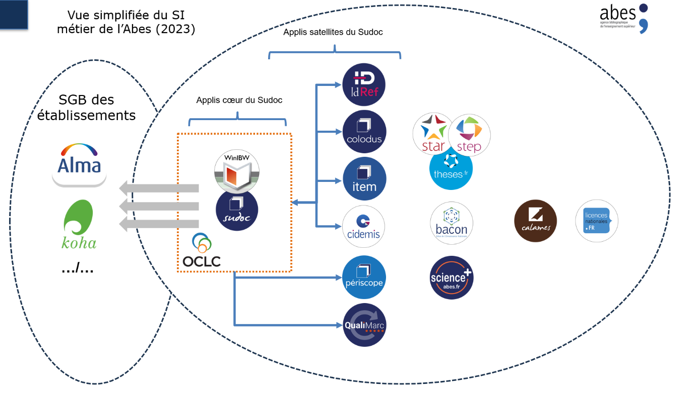

# Projet d’établissement 2024-2028 de l'Abes

Version 1.1 du projet d'établissement 2024-2028 de l'Abes publiée au 26/09/2023.

## Résumé exécutif

L’Abes souhaite grâce à ce projet affirmer son rôle dans la *fourniture
de métadonnées de qualité aux organisations de l’enseignement supérieur
et de la recherche*.

Cet objectif général de long terme est servi pour la période 2024-2028
par des objectifs de courts et moyens termes :

  - Renouveler le système d’information métier de l’Abes ;

  - Permettre une politique de données plus massives, aux traitements
    plus automatisés et au périmètre fonctionnel plus large, répondant
    aux nouveaux besoins en référentiels de l’ESR ;

  - Renouveler et sécuriser le rôle de l’Abes dans les achats de
    documentation électronique

  - Renouveler les modalités de relations de l'Abes aux réseaux de l'ESR

  - Renforcer la Recherche et Développement de l’agence

  - Adapter l’agence à ces nouvelles orientations

## Renouveler le Système d’Information de l’Abes

Historiquement, il y a eu deux périodes distinctes d’organisation du SID
à l’Abes : dans la première moitié de la vie de l’Abes, son SID a été
organisé de façon relativement centralisée autour d’un produit acquis
sur le marché (la suite CBS, WinIBW, PSI proposée par le prestataire
OCLC) ; depuis un peu plus de 10 ans et pour permettre d’étendre les
services proposés, une partie du SID a été déportée dans des
applications « satellites » connectées au système historique et
développées en interne. Une partie de nos outils enfin (Calames, Star,
Step et theses.fr) disposent de leur propre base de données maîtresse et
ont une indépendance plus importante par rapport à CBS.

Figure 1 - vue simplifiée du SI métier de l'Abes

Cet ensemble est devenu progressivement plus complexe et lourd à gérer,
il a accumulé une dette technique qui représente aujourd'hui un risque
pour l'Abes comme pour les établissements. Il entrave aussi la mise en
place de nouveaux services et limite la capacité de l’agence à
renouveler son offre pour répondre plus efficacement aux besoins des
établissements et à leurs évolutions.

### Le cadre et les objectifs d’une réinformatisation

Ce projet priorisera donc le renouvellement du système d’information
métier de l’Abes. L’action de l’Abes sur ce point sera guidée par les
objectifs suivants.

L'objectif principal devra être de proposer un renouvellement de l’offre
proposée aux établissements qui leur permette à la fois de disposer de
plus de métadonnées, plus faciles à exploiter et à des coûts moindres.
Le ou les outils mis en place devront aussi permettre à l’Abes de
simplifier son architecture et ainsi de faire baisser les coûts de
propriété et d’exploitation de son système d’information.

L'objectif de maintenir la souveraineté sur les données que contiendra
le nouveau système est un impératif que le projet devra prendre en
compte. Cette question est juridique, mais aussi technique : une
attention toute particulière sera donnée aux capacités du futur système
à permettre à l’Abes de gérer de la façon la plus autonome possible les
entrées et les sorties de données.

Le projet aura pour objectif de couvrir au sein d'un même système les
métadonnées qui concernent tant la documentation papier que la
documentation électronique, au-delà des niveaux livres et revues, en
intégrant le niveau bouquet commercial, voire le niveau des chapitres
et articles. Plus généralement, un rassemblement, et partant une
réduction de la quantité actuelle des bases et outils de gestion de
métadonnées composant le SI de l'Abes, sont fortement souhaitées.
Concernant les données, il est fortement souhaité que le nouveau système
offre la perspective de sortir, au moins à terme, des formats MARC vers
un système entités - relations, en particulier pour une plus grande
intégration dans les échanges internationaux. Cette problématique peut
concerner la gestion des données par le système lui-même ou l’export et
la diffusion des données vers l’extérieur.

L'objectif de maîtrise des coûts complets de possession du nouveau
système, tant dans la période de projet qu'ensuite dans sa phase de
fonctionnement courant, doit être une exigence. Cet objectif inclut la
prise en compte du risque que représenterait la gestion d'un système
dont une grande partie serait réalisée en interne : l'Abes recherchera
donc une solution actuellement existante sur le marché, garantissant la
réalisation du projet dans le calendrier imparti, à des coûts maitrisés.
Cette contrainte contribuera également à la réussite de l’objectif de
simplification et d’amélioration de la lisibilité du système
d’information.

Cet impératif de mettre l’expression des besoins en adéquation avec les
possibilités réelles des solutions qu’il est possible de trouver
aujourd'hui sur le marché doit être nuancé sur plusieurs points :

  - On ne doit pas exclure la possibilité de réaliser ou faire réaliser
    les développements complémentaires qui permettraient de répondre aux
    besoins qui ne seraient pas couverts initialement par le système
    envisagé

  - Un poids important sera donné à la capacité de l'établissement à
    utiliser le système en toute autonomie et à en étendre les
    fonctionnalités pour répondre aux besoins spécifiques de ses
    utilisateurs, par exemple en privilégiant un système proposant un
    panel très large d’*Application Programming Interfaces* (APIs)

  - Une solution disposant d'une licence de logiciel libre pourrait
    aussi représenter un atout en termes d’autonomie et fera l'objet
    d'une instruction spécifique

### Une politique des interfaces web

Une partie des interfaces proposées par l’Abes devra être renouvelée
dans le cadre du changement de SI. Ce changement des interfaces
professionnelles et publiques est donc à interpréter comme une des
contraintes et objectifs du SID prioritairement.

Pour la production dans les réseaux, l’Abes devra :

  - Passer au *full web* et simplifier les interfaces pour la production
    « à l’unité » afin de permettre, au sein des établissements, de
    baisser le coût d’accès au service de catalogage. Des gains sont
    attendus pour la gestion du parc informatique des établissements,
    mais également pour répondre aux besoins de formation et
    d’accompagnement, permettant aux établissements qui le souhaitent
    de diversifier leur organisation interne pour la création de données
    à l’unité.

  - Donner plus d’autonomie aux experts des établissements par
    l’intermédiaire des interfaces pour réaliser des modifications de
    masse, constituer des lots de données, exporter et importer plus
    facilement les données.

Pour les interfaces publiques associées au nouveau SID de l’Abes, et
pour les interfaces publiques des applications que nous continuerions de
gérer en dehors du SID renouvelé, nous devons nous fixer les objectifs
suivants, par ordre décroissant de priorité :

  - Moderniser les interfaces publiques de recherche pour respecter
    l’état de l’art et avec une attention particulière à
    l’accessibilité

  - Montrer une interface de consultation construite sur des données
    organisées en entités - relations, au moins à titre pilote et en fin
    de période

  - Permettre aux établissements qui le souhaitent de personnaliser de
    façon autonome une interface de recherche qui porte sur un périmètre
    de données qui leur est propre

## Une « base de métadonnées » pour l’ESR

### Un signalement de masse utilisant les flux de données 

Le signalement des ressources, et tout particulièrement celui des
ressources électroniques, devient de plus en plus chronophage au regard
de la diversité et de la quantité des ressources à traiter. L’Abes a
pour mission première de proposer un catalogue collectif de la
documentation proposée par les établissements de l’enseignement
supérieur et de la recherche : malgré des efforts substantiels, cette
promesse a été difficile à tenir depuis la massification de la
documentation électronique et les attentes des établissements à ce sujet
sont fortes. Ces attentes sont de deux ordres :  

  - Obtenir plus rapidement des volumes plus importants de métadonnées
    de qualité, en particulier associées aux bouquets commerciaux de
    documentation électronique acquis par les établissements ;

  - Réduire la dispersion et les coûts de traitement des informations
    relevant de la documentation électronique (entre catalogage des
    monographies dans le Sudoc, signalement des articles dans Science+,
    métadonnées de gestion dans Bacon, activation ou signalement des
    bouquets dans les outils de l’établissement)

  - Améliorer les interactions entre systèmes d’informations locaux et
    les systèmes de l’Abes

L’Abes souhaite y répondre en s’appuyant sur les fonctionnalités et
ressources du nouveau système d’information.

### Une volumétrie plus importante

L’Abes cherchera à établir une politique d’imports de données plus
ambitieuse, en particulier pour la documentation électronique. Si des
imports systématiques et globaux sont un horizon théorique, une
politique réaliste doit fixer, en concertation avec les établissements,
une priorisation appuyée sur les usages de la documentation électronique
dans les établissements de l’ESR. Cette politique doit englober les
différents niveaux de granularité des métadonnées (ebooks et chapitres
d’ebooks, les revues et articles, bouquets, etc.).

### Prioriser les flux de données

  - Etendre les flux de localisation. Il s’agit de généraliser et
    standardiser les flux mis en place ces dernières années pour une
    partie des exemplaires d’ebooks. L’Abes doit proposer ces flux à
    l’ensemble des réseaux et de les étendre à la documentation
    imprimée : l’objectif est de faciliter la synchronisation
    automatique entre les systèmes locaux et le SI de l'Abes à partir
    des données fournies par les établissements à dessein d’éviter les
    doubles saisies, en local et dans les applications de l’Abes.

  - Etendre la politique d’APIs de l’Abes. Ces outils qui permettent aux
    utilisateurs d’interagir avec les outils de l’Abes par un dialogue
    de machine à machine ne concernent aujourd’hui qu’une partie des
    données, et ne permettent, hormis le cas très spécifique du circuit
    des thèses, que des accès en lecture seule. Il s’agira de passer
    progressivement de la lecture seule à un système permettant le
    « CRUD » (création, lecture, mises à jour, suppressions de données
    - «* APIs CRUD* »). Cet objectif ambitieux offrirait aux
    établissements une gamme de services considérablement plus étendue,
    qui devra être encadré pour garantir la sécurité des systèmes ainsi
    que l’intégrité et la qualité des données.

  - Définir une politique de diffusion des données en direction des
    partenaires (qu’il s’agisse de leurs outils propres ou de ceux de
    leurs prestataires).

### Définir une politique des données

Dans tous les échanges avec les réseaux de l’Abes, la question de la
qualité des données diffusées par l’Abes revient de manière récurrente.
Il est particulièrement difficile d’y répondre, tant la notion de
qualité renvoie à des questions sur leur usage, sur le contexte de
signalement et le type de fonds décrits, sur le public bénéficiaire de
ces ressources, etc. La définition de la qualité est fonction des
besoins de l’établissement.

L’Abes peut néanmoins donner à ses utilisateurs les moyens d’évaluer la
qualité des données, pour en faciliter l’exploitation et la
réutilisation. 

  - Améliorer la qualité des données exige une plus grande transparence
    dans leur diffusion. L’Abes doit désormais s’atteler à qualifier les
    données qu’elle expose, afin d’en faciliter l’usage et de renforcer
    la confiance de ses partenaires

  - Adosser ce travail de qualification à une politique de diffusion et
    de droits de réutilisation des données

  - Viser collectivement un niveau de qualité plus élevé, et défini,
    pour un ensemble de données jugées stratégiques pour l’ESR. Sa
    définition sera pensée en concertation avec les parties prenantes
    de l’Abes. Les données de publications françaises de niveau
    recherche et en Open Access, ainsi que les données de fonds
    patrimoniaux ou susceptibles d’entrer dans les programmes de
    numérisation nationaux, pourraient par exemple être spécifiquement
    ciblés.

### Référentiels : contribuer à la simplification et à la lisibilité du paysage de l’ESR par un référentiel des agents

L’Abes et, avec elle, les réseaux documentaires ont une longue habitude
de création d’autorités auteur et collectivité associées aux
publications signalées.

Depuis quelques années, ces données ont pris une importance stratégique
qui nous amène à les considérer collectivement dans un sens nouveau : il
s’agit de référentiels, appuyés sur des identifiants uniques et
pérennes, qui servent non seulement les besoins documentaires mais
aussi de nombreux besoins d’autres acteurs de l’ESR.

Un travail a été mené de longue date dans cette direction avec IdRef,
étendu depuis 2019 avec la constitution du consortium Orcid France. Ce
travail sur les personnes doit être non seulement relancé dans ses
ambitions mais étendu à un effort similaire à propos des structures de
l’enseignement supérieur et de la recherche.

Cette politique est en cours de définition au niveau du ministère de
l’enseignement supérieur et de la recherche et l’Abes y apportera ses
compétences, en particulier pour la gestion des données.

Qu’il s’agisse des agents personnes ou des agents collectifs, ce
mouvement qui vise à adapter la gestion des données pour en permettre un
usage généralisé au sein de l’enseignement supérieur vient en appui de
la politique des établissements documentaires dont l’action est
désormais étroitement associée au pilotage de leur institution et au
soutien à l’activité des enseignants et chercheurs.

Par ailleurs, cet effort portant spécifiquement sur les référentiels
agents représentera pour l’Abes une étape concrète sur le chemin qui
mène d’un catalogue bibliographique à un modèle de données entités –
relations.

## Acquisitions de documentation électronique

Il est impératif que ce travail mené en collaboration avec Couperin mais
qui n’est pas à ce stade une mission inscrite dans les statuts de
l’Abes, soit sécurisé pour les années à venir.

Cet effort de sécurisation se fera dans une recherche de consensus entre
l'Abes, Couperin et le MESR. Un effort particulier sera fait en ce sens
en 2024 pour arriver progressivement à stabiliser l’activité sur la
durée du projet.

### Assurer la soutenabilité de la mission. 

Il est impératif de sécuriser le modèle économique de cette activité
pour l’Abes. Le suivi de l’activité des 15 groupements de commande
actuels nécessiterait de 2 à 4 ETP supplémentaires, alors que la
complexité des dossiers et les besoins de portage, en particulier sur le
volet juridique des négociations, vont croissant.

  - Le modèle des frais de gestion sera revu avec un double objectif de
    plus grande équité entre les participants et de réalisme, tant par
    rapport au coût du service qu’à la valeur apportée à l’ensemble de
    l’écosystème

  - L’Abes devra par ailleurs travailler avec la tutelle à
    l’officialisation réglementaire de cette mission dans ses statuts

### Définir des critères pour des « groupements de commandes à portée nationale »

L’Abes analyse aujourd’hui les demandes de portage des groupements de
commande au cas par cas. Une politique de portage aux critères
explicites est aujourd’hui nécessaire pour sécuriser l’action tant de
l’Abes que de ses partenaires. L’Abes, opérateur du MESR, a vocation à
porter des « groupements de commandes à portée nationale » qu’il
s’agira, dans un travail commun avec Couperin et la tutelle, de
définir.

En première analyse, ces critères peuvent être quantitatifs, et prendre
par exemple en compte le chiffre d’affaires représenté par le groupement
et le nombre d’établissements qui y adhèrent. Ils peuvent aussi être
qualitatifs, par exemple pour les groupements qui concerneraient les
politiques stratégiques de l’état autour de l’*Open Access* et du
soutien à l’édition scientifique francophone ou les contrats de licences
nationales.

Il s’agit de parvenir à une grille d’analyse objective et commune
permettant de décider ou non du portage d’un groupement de commande, et
d’asseoir ainsi le portefeuille pris en charge par l’Abes.

### Définir le périmètre d’intervention fonctionnel de l’Abes

La complexité croissante des groupements de commande notée ci-dessus a
rendu progressivement, ces dix dernières années, la frontière entre
négociation et contractualisation extrêmement poreuse. Couperin et
l’Abes ont progressivement adapté leur fonctionnement courant à cette
situation et l’Abes est désormais systématiquement présente lors des
négociations.

Cette adaptation pragmatique sera réexaminée plus explicitement par les
deux partenaires pour aboutir en commun à un nouveau formalisme
permettant de mieux exploiter les compétences des uns et des autres.

## Réseaux et partenaires

Une adaptation des dispositifs d’accompagnement des utilisateurs et
partenaires des produits et services de l’Abes est rendue nécessaire par
ce projet d’établissement. Il implique de nouveaux services qui devront
être accompagnés. Il correspond aussi à un moment de l’histoire de
l’agence où les dispositifs nés avec la mise en place du Sudoc et
progressivement étendus depuis au fil de l’extension des services ont
besoin d’être repensés globalement.

### De nouveaux réseaux

Déployer des efforts de développement, d’animation et de suivi
spécifiques pour :

  - Un espace de dialogue stratégique et politique renouvelé, incluant
    la création d’un Conseil d’Orientation Stratégique, proposé par
    l’HCERES, mais proposant également d’autres modes de dialogue et
    de co-construction avec les directions des établissements, dont on
    rendra compte aux instances

  - La mise en place d’un réseau « technique » en soutien de la
    politique de flux et d’API : au sein du secteur documentaire
    (“bibliothécaires système”, clubs utilisateurs de logiciels,
    commission SSI de l’ADBU), mais aussi au-delà (DSI, AMUE, etc.) au
    sein de l’ESR

  - Un réseau pour le signalement de la documentation électronique,
    prenant en compte les problématiques de massification des données

  - Un réseau Sudoc-PS renouvelé dans sa structuration et ses objectifs,
    en collaboration avec les réseaux de la Culture

### Une relation aux réseaux renouvelée

Redéfinir une stratégie globale de liens avec les réseaux, y compris
pour les réseaux existants, dans un objectif d’efficience. Il s’agit
d’adapter le fonctionnement de l’Abes à une nouvelle offre et aux
réseaux renouvelés. Il s’agit aussi de mesurer la plus–value de
l’investissement de l’Abes auprès de ses interlocuteurs, de
privilégier leur autonomie, et de prendre notamment en compte les
besoins d’accompagnement directement associés au renouvellement du SI
métier de l’Abes dans la période considérée.

Cette problématique d’évolution de l’accompagnement dispensé par l’Abes
englobe :

  - La communication

  - La documentation et les dispositifs d’assistance

  - Les formations en ligne ou en présentiel, et les partenariats de
    formation

  - Inscrire dans l’organisation de l’agence les mécanismes nécessaires
    au recueil constant des besoins utilisateurs

## Renforcer la politique de Recherche et Développement

Le labo de l’Abes mène depuis plusieurs années des travaux et réflexions
autour de l’intelligence artificielle (IA). La volonté exprimée dans ce
projet de mettre l’accent sur les volumétries de données et leur
insertion croissante dans les systèmes d’information de l’ESR doit
amener l’établissement à renforcer sa politique de recherche et
développement.

Si l’Abes n’a pas vocation à faire de la recherche en tant que telle,
l’agence doit néanmoins amplifier son rôle d’éclaireuse et de
défricheuse des apports des technologies, l’IA en particulier, pour le
traitement, la curation et l’enrichissement de grandes masses de
métadonnées, la création de nouveaux outils destinés à rendre les
professionnels plus autonomes et plus efficients pour certaines
activités, l’automatisation de tâches.

L’Abes veillera à ce que ces travaux répondent à des objectifs
d’industrialisation : une fois avéré l’intérêt d’un marché de taille
critique, la création d’une offre issue du processus de R\&D doit
pouvoir être transférée à l’échelle dans les processus et les outils
proposés à l’ensemble des partenaires.

L’Abes mènera ces travaux de R\&D dans le cadre de partenariats :

  - Organisations ayant des démarches similaires de R\&D utilisant l’IA
    dans le secteur documentaire

  - Partenaires permettant de valider les cas d’usages, en particulier
    les établissements utilisateurs des produits et services de l’Abes

  - Partenaires privés apportant leurs compétences, leur force de
    travail et leurs capacités industrielles

Deux grandes orientations feront l’objet de travaux dans le cadre de ce
projet :

  - Appliquer l’IA sur les données gérées par l’Abes, dans une démarche
    d’ouverture à la fois des données source, des données résultant des
    traitements, et des modèles utilisés pour en permettre la plus
    grande réutilisation

  - Proposer des services d’assistance par l’IA aux utilisateurs des
    logiciels proposés par l’agence

## Organisation, GPEEC, missions et évaluation

Une fois les objectifs du projet validés, l’Abes doit s’organiser pour
le mettre en œuvre. C’est en soi une partie du projet, qui nécessite des
ressources et doit se dérouler dans les premiers temps du projet.

  - Mise en place d’ici le second semestre 2024 d’une nouvelle
    organisation de l’Abes, adaptée aux nouveaux besoins et objectifs
    identifiés par le PE2024

  - Mise en place d'un programme de GPEEC, s'appuyant sur une analyse
    des compétences actuelles des équipes, et incluant un plan de
    formation traduisant les besoins de l'établissement tels qu'exprimés
    par le PE2024-2028.

  - Traduire, dans un décret modifié, le PE2024 et ses grandes
    orientations au-delà de la période de projet en missions, et définir
    de nouvelles instances représentatives des réseaux renouvelés ;
    Inscrire dans l’organisation de l’Abes, et dans l’ensemble des
    actions de ce projet d’établissement, les critères et dispositifs
    d’évaluation des activités de l’agence qui seront nécessaires au
    pilotage de l’établissement et au suivi de la réalisation du projet.
    Cette évaluation inclura des objectifs environnementaux, en
    particulier sur deux points : la sobriété numérique et l’empreinte
    carbone globale de l’établissement.
