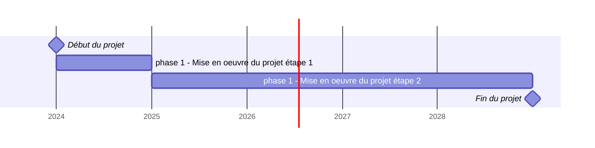

# Calendrier prévisionnel du projet 2024-2028 de l'Abes

<u>Avertissement</u>

Ce calendrier prévisionnel du [projet 2024-2028 de l'Abes](./projet2024) a été réalisé en l'état actuel de nos connaissances. Il est susceptible d'évoluer tout au long de la période en fonction de son déroulé. 

## Calendrier partie 1 ....

Lorem ipsum dolor sit amet, consectetur adipiscing elit, sed do eiusmod tempor incididunt ut labore et dolore magna aliqua. Ut enim ad minim veniam, quis nostrud exercitation ullamco laboris nisi ut aliquip ex ea commodo consequat. Duis aute irure dolor in reprehenderit in voluptate velit esse cillum dolore eu fugiat nulla pariatur. Excepteur sint occaecat cupidatat non proident, sunt in culpa qui officia deserunt mollit anim id est laborum

TODO : remplacer par le contenu de la v2.2
...