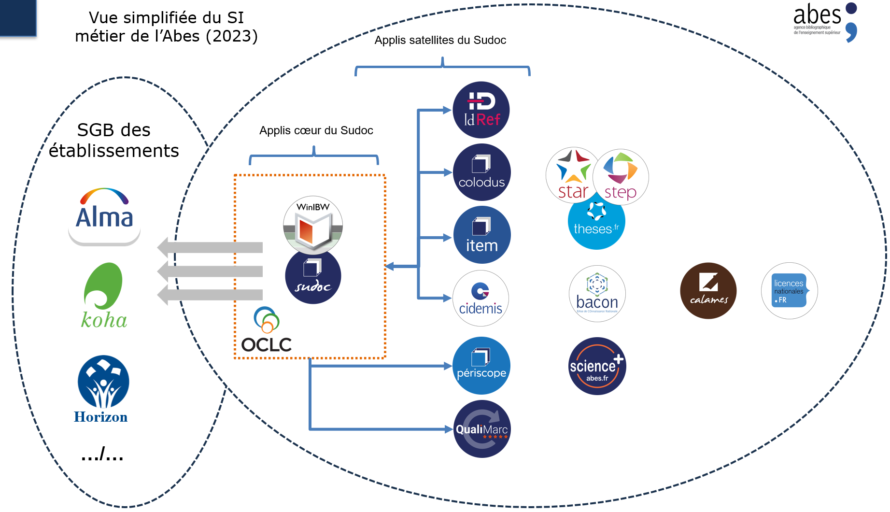

# Projet d’établissement 2024-2028 de l'Abes

Version finale (2.4) du projet d'établissement 2024-2028 de l'Abes publiée le 24/11/2023.

## 1\. Résumé exécutif

L’Abes souhaite grâce à ce projet affirmer son rôle dans la fourniture
de métadonnées de qualité aux organisations de l’enseignement supérieur
et de la recherche.

Cet objectif général de long terme est servi pour la période 2024-2028
par des objectifs de courts et moyens termes :

  - Renouveler le système d’information métier de l’Abes ;

  - Permettre une politique de données plus massives, aux traitements
    plus automatisés et au périmètre fonctionnel plus large, répondant
    aux nouveaux besoins en référentiels de l’ESR ;

  - Renouveler et sécuriser le rôle de l’Abes dans les achats de
    documentation électronique ;

  - Renouveler les modalités de relations de l’Abes aux réseaux de
    l’ESR ;

  - Renforcer la recherche et développement de l’agence, en se
    concentrant sur les applications de l’état de l’art en intelligence
    artificielle ;

  - Adapter l’agence à ces nouvelles orientations

## 2\. Le système de gestion de métadonnées de l’Abes

Historiquement, il y a eu deux périodes distinctes d’organisation du
système de gestion à l’Abes : dans la première moitié de la vie de
l’Abes, son architecture a été organisée de façon relativement
centralisée autour d’un produit acquis sur le marché (la suite
logicielle CBS, WinIBW, PSI, APCC proposée par le prestataire OCLC) ;
depuis un peu plus de 10 ans et pour permettre d’étendre les services
proposés, une partie du système de gestion de métadonnées a été déportée
dans des applications « satellites » connectées au système historique et
développées en interne. Une partie de nos outils enfin (Calames, Star,
Step et theses.fr) disposent de leur propre base de données maîtresse et
ont une indépendance plus importante par rapport à CBS.

Figure 1 — vue simplifiée du système d’information métier de l’Abes

Cet ensemble est devenu progressivement plus complexe et lourd à gérer,
il a accumulé une dette technique qui représente aujourd’hui un risque
pour l’Abes comme pour les établissements. Il entrave également la mise
en place de nouveaux services et limite la capacité de l’agence à
renouveler son offre pour répondre plus efficacement aux besoins des
établissements et à leurs évolutions.

### 2.1 Le cadre et les objectifs d’une réinformatisation

Ce projet pose donc comme priorité le renouvellement du système
d’information métier de l’Abes. L’action de l’Abes sur ce point sera
guidée par les objectifs définis ci-dessous.

L’objectif principal consiste à renouveler l’offre proposée aux
établissements par un système qui leur permettra de disposer de plus de
métadonnées, plus faciles à exploiter et à des coûts moindres. Le ou les
outils mis en place devront aussi permettre à l’Abes de simplifier son
architecture et ainsi de faire baisser les coûts de propriété et
d’exploitation de son système d’information.

La souveraineté sur les données que contiendra le nouveau système est un
impératif que le projet doit prendre en compte. Cette question est
juridique, mais aussi technique : une attention toute particulière sera
donc donnée aux capacités du futur système à permettre à l’Abes de gérer
de la façon la plus autonome possible les entrées et les sorties de
données de tous types.

Le projet aura pour objectif de couvrir, au sein d’un même système, les
métadonnées qui concernent la documentation papier et la documentation
électronique, au-delà des livres et revues, en intégrant également les
bouquets commerciaux, voire les métadonnées de chapitres et d’articles.

À cette occasion, une diminution du nombre des bases de données et
d’outils de gestion de métadonnées qui composent le système de gestion
de métadonnées actuel de l’Abes est fortement souhaitée. Cette
homogénéisation des données et des outils permettra d’améliorer la
lisibilité de l’offre de services de l’Abes et son appropriation par les
utilisateurs professionnels et les autres publics.

Concernant les données, il est souhaité que le nouveau système offre la
perspective de sortir, au moins à terme, d’une logique de notice,
inscrite notamment dans le format MARC, pour aller vers un système
entités — relations. L’adoption d’une logique entités-relations a
plusieurs avantages :

  - Faciliter la compatibilité de nos données avec les modèles
    conceptuels de données bibliographiques existant actuellement, dont
    en priorité IFLA LRM, référence de l’information bibliographique

  - Proposer une représentation en principe plus souple et évolutive des
    données gérées au sein du système

  - Faciliter l’export et l’exposition des données dans la perspective
    de leur réutilisation par des tiers, y compris en dehors du monde
    des bibliothèques.

Cette problématique concerne la gestion des données par le système
lui-même ainsi que l’export et la diffusion des données.

L’objectif de maîtrise des coûts complets de possession du nouveau
système, dans la période de projet et ultérieurement, dans sa phase de
fonctionnement courant, est une autre exigence. Cet objectif inclut la
prise en compte du risque que représenterait la gestion d’un système
dont une grande partie serait réalisée en interne : l’Abes recherchera
donc une solution actuellement existante sur le marché, garantissant la
réalisation du projet dans le calendrier imparti, à des coûts maîtrisés.
Cette contrainte contribuera également à la réussite de l’objectif de
simplification et d’amélioration de la lisibilité du système
d’information.

Cet impératif de mettre l’expression des besoins en adéquation avec les
possibilités réelles des solutions qu’il est possible de trouver
aujourd’hui sur le marché doit être nuancé sur plusieurs points :

  - On ne doit pas exclure la possibilité de réaliser ou de faire
    réaliser les développements complémentaires qui permettraient de
    répondre aux besoins initialement non couverts par le système
    envisagé.

  - Un poids important sera donné à la capacité de l’Abes à utiliser le
    système en toute autonomie, en particulier, mais non exclusivement,
    pour la gestion globale des métadonnées, et à en étendre les
    fonctionnalités pour répondre aux besoins spécifiques de ses
    utilisateurs, par exemple en privilégiant un système proposant un
    panel très large d’*Application Programming Interfaces* (API).

  - Une solution disposant d’une licence de logiciel libre pourrait
    aussi représenter un atout en termes d’autonomie et fera l’objet
    d’une instruction spécifique.

<u>Critères de réussite</u> :

  - Une première tranche du système de gestion, à définir, sera en
    production en 2027 pour permettre la mise en place de nouveaux
    services dans la période de fin de projet.

  - Les métadonnées des ressources imprimées et électroniques (ebooks,
    revues, bouquets) sont gérées nativement par le nouveau système de
    gestion de métadonnées.

<u>Critères de réussite étendus</u> :

  - Le nouveau système de gestion de métadonnées sait gérer et manipuler
    des données entités-relation.

  - Le nouveau système de gestion de métadonnées intègre les métadonnées
    de niveau articles et chapitre de ressources électroniques

### 2.2 Une politique d’interfaces web

Une partie des interfaces proposées par l’Abes sera renouvelée dans le
cadre du changement de système de gestion de métadonnées. Ce changement
des interfaces professionnelles et publiques est un objectif prioritaire
du nouveau système.

Pour la création, modification, lecture et suppression des données par
les réseaux, l’Abes doit :

  - Passer au *full web* et simplifier les interfaces pour la production
    « à l’unité » afin de faciliter le catalogage au sein des
    établissements. Des gains sont attendus pour la gestion du parc
    informatique des établissements, mais également pour répondre aux
    besoins de formation et d’accompagnement, permettant aux
    établissements qui le souhaitent de diversifier leur organisation
    interne pour la gestion de données de catalogage à l’unité.

  - Donner plus d’autonomie aux experts des établissements par
    l’intermédiaire des interfaces pour réaliser des modifications de
    masse, constituer des lots de données, exporter et importer plus
    facilement les données.

Pour les interfaces publiques associées au nouveau système de gestion de
métadonnées de l’Abes, et pour les interfaces publiques des applications
que nous continuerions de gérer en dehors du système de gestion de
métadonnées renouvelé, les objectifs suivants sont fixés, par ordre
décroissant de priorités :

  - Moderniser les interfaces publiques de recherche pour respecter
    l’état de l’art, avec une attention particulière accordée à leur
    accessibilité ;

  - Montrer une interface de consultation construite sur des données
    organisées en entités — relations, au moins à titre pilote, en fin
    de période ;

<!-- end list -->

  - Permettre aux établissements qui le souhaitent de personnaliser de
    façon autonome une interface de recherche qui porte sur un périmètre
    de données qui leur est propre.

<u>Critères de réussite</u> :

  - Le portail public du système de gestion de métadonnées est une
    interface web respectant le RGAA et détenant une homologation de
    sécurité ;

<!-- end list -->

  - L’interface de catalogage du système de gestion de métadonnées est
    une interface web proposant des formulaires pour créer ou modifier à
    l’unité les données ;

<!-- end list -->

  - Un nouveau service d’administration de données par lot ou à l’unité
    est proposé aux experts dans les réseaux.

<u>Critères de réussite étendus</u> :

  - Le portail public du système de gestion de métadonnées propose aux
    établissements un backoffice qui permet la personnalisation de
    l’interface web et la valorisation de données ;

  - Un démonstrateur proposant une interface de consultation exploitant
    la valeur ajoutée des données en entités-relation est ouvert
    publiquement.

### 2.3 Une stratégie Open Source

Depuis le précédent projet d’établissement, l’Abes a orienté sa
politique de développement vers l’Open Source. Ainsi, tous les codes
sources des nouveaux projets initiés par l’établissement sont publiés en
Open Source sur la plateforme Github. Cette stratégie apporte différents
avantages :

  - Amélioration de la qualité et de la sécurité des logiciels : le code
    étant ouvert, l’Abes est totalement transparente sur sa production
    de code vis-à-vis de ses partenaires ;

  - Possibilité de réutilisation et de partage de briques logicielles ;

  - Possibilité d’adhérer à une communauté Open Source existante.

L’Abes renforcera cette stratégie au cours du prochain projet
d’établissement, et pourra potentiellement l’étendre, en particulier
dans le choix de ses outils, y compris pour le remplacement du système
de gestion de métadonnées. L’Abes n’exclut pas de mettre à disposition
des moyens humains ou financiers pour améliorer les logiciels Open
Source qu’elle serait amenée à utiliser, mais une vigilance particulière
sera apportée à la notion de *fork* (copie d’une version du code d’une
application en vue de la modifier pour en faire une version spécifique à
l’agence). En effet, utiliser un *fork* de code source peut augmenter
significativement les coûts de possession, dont la maîtrise est un
objectif prioritaire.

<u>Critères de réussite</u> :

  - Dans le cas du choix d’un logiciel Open Source pour le système de
    gestion de métadonnées, l’Abes participe activement à la communauté
    Open Source ;

  - Dans le cas du choix d’un logiciel Open Source pour le système de
    gestion de métadonnées, l’Abes ne *fork* pas le logiciel : les
    fonctionnalités développées sont intégrées à la *roadmap* du
    logiciel ;

  - Tout *plugin* ajouté au système de gestion de métadonnées ou toute
    application satellite développée par l’Abes a un code dont la
    licence est Open Source.

### 2.4 Une stratégie d’API

La stratégie « *API first* » adoptée par l’Abes consiste à proposer
prioritairement des services orientés machines pour répondre aux
besoins :

  - de décorrélation entre la forme (interfaces utilisateurs) et le fond
    (traitement sur les données, calculs et algorithmes)

  - d’interopérabilité avec les systèmes d’information de l’ESR

  - de liberté dans les choix des langages utilisés pour les traitements
    ou les interfaces qui permettent d’exploiter ces API

  - de sécurité : les données ne sont accessibles que via les API
    préalablement sécurisées

Le futur système de gestion de métadonnées devra intégrer nativement non
seulement des services orientés utilisateurs, mais aussi et avant tout
des API ouvertes respectant l’état de l’art.

Les applications satellites (présentes et futures) s’appuieront sur cet
état de l’art, soit en exploitant les API du système de gestion de
métadonnées, soit en proposant elles-mêmes de nouvelles API.

Toutes les API développées par l’Abes seront publiées et documentées sur
<https://api.gouv.fr/>. Les services (présents et futurs), qui
graviteront autour du futur système de gestion de métadonnées,
s’appuieront sur ces mêmes principes.

Les API proposées par l’Abes aux réseaux sont actuellement en lecture
seule. Les futures API mises à disposition des réseaux proposeront
aussi, dès leur conception, des opérations de création, modification et
suppression de données (appelées «* [API
CRUD](https://fr.wikipedia.org/wiki/CRUD)* »). Ces nouvelles
fonctionnalités seront proposées en natif par le nouveau système de
gestion de métadonnées et toutes les nouvelles applications ayant comme
objectif d’écrire des données dans les systèmes de l’Abes disposeront
d’API CRUD.

Ces API demanderont une authentification aux machines souhaitant y
accéder, qui permettra de sécuriser le service offert, de le piloter et
d’offrir des services adaptés à chaque catégorie d’utilisateurs.

<u>Critères de réussite</u> :

  - Au moment de sa mise en production, le nouveau système de gestion de
    métadonnées de l’Abes dispose d’API publiquement documentées ;

  - Toute prochaine application satellite qui serait développée par
    l’Abes dispose d’API publiquement documentées sur
    <https://api.gouv.fr> ;

  - Le système de gestion de métadonnées de l’Abes propose des API en
    écriture ;

  - Avant la fin du projet, un service de création, lecture,
    modification et suppression d’exemplaires est ouvert avec des API ;

  - Au cours de ce projet, une note d’étude pose les conditions
    nécessaires à la mise en place d’API de création, lecture,
    modification et suppression de données bibliographiques.

<u>Critère de réussite étendu</u> :

  - Des API de création, lecture, modification et suppression de données
    bibliographiques sont proposées aux établissements

### 2.5 Le renouvellement du système de gestion de métadonnées au cœur du projet

Aujourd’hui, de nombreux services basés sur les données du Sudoc sont
proposés aux réseaux de l’Abes. Ces services s’opèrent soit par des
applications nativement proposées par OCLC (interface publique du Sudoc,
transferts réguliers, catalogage *via* WinIBW) soit par des applications
informatiques, appelées plus haut « applications satellites »,
développées et exploitées par l’Abes comme IdRef, Colodus, Item,
Cidemis, Périscope, Qualimarc, Paprika, ou les *micro-web services*.

Ces applications manipulent en lecture ou en écriture les données du
Sudoc, qui en est la base de données maîtresse. Les opérations de
lecture et d’écriture réalisées par les applications satellites sont
faites par une librairie Java développée par l’Abes permettant de
communiquer avec le cœur du Sudoc via une connexion *ad hoc* non
documentée.

Concernant le renouvellement des services existants et le changement de
système de gestion de métadonnées, plusieurs cas sont à considérer :

1.  Service existant rendu par une application satellite qui sera
    nativement intégré au nouveau système de gestion de métadonnées

2.  Service existant rendu par une application satellite qui ne pourra
    pas être intégré au nouveau système de gestion de métadonnées

3.  Nouveau service directement rendu par le nouveau système de gestion
    de métadonnées

Dans le premier cas, le renouvellement du système de gestion de
métadonnées de l’Abes permettra de remplacer entièrement l’application
par des fonctionnalités intégrées nativement dans le nouveau système. À
noter qu’un remplacement de ce type pourra générer des améliorations,
des régressions ou imposer une nouvelle façon de rendre le service. La
complexité de ce cas de figure réside surtout dans l’accompagnement au
changement. L’Abes cherchera le plus possible à remplacer ses
applications satellites par le système de gestion de métadonnées pour
augmenter le retour sur investissement de ce changement de système.

Dans le second cas, l’application satellite devra être conservée et il
sera alors nécessaire de remplacer la couche de communication
propriétaire (librairie Java) par une couche de communication basée sur
les API ouvertes du nouveau système. Cette opération est risquée et
coûteuse d’un point de vue technique. En effet, un modèle de données
éloigné du modèle actuel pourrait modifier en profondeur la logique
interne de l’application. Et certaines applications ont accumulé une
dette technique importante qui nécessiterait non seulement une
modification du protocole de communication, mais une refonte complète.

Enfin, dans le dernier cas, de nouveaux services seront nativement
proposés par les fonctionnalités du système de gestion de métadonnées.
L’ouverture de ces services nécessitera essentiellement de la
formation, de l’accompagnement et de la communication comme à
l’ouverture de tout nouveau service proposé par l’Abes.

C’est uniquement à travers ces trois cas de figure que des services
existants ou nouveaux seront proposés aux réseaux de l’Abes dans les
cinq années de ce projet d’établissement. Les services qui seront
concernés, comme les nouvelles interfaces publiques ou les services
relatifs à la base de métadonnées pour l’ESR, seront donc disponibles
une fois terminé le changement de système de gestion de métadonnées.

Il existe donc une très forte dépendance entre le moment où ce nouveau
système sera en production et le moment où de nouveaux services listés
dans ce projet pourront être proposés.

Le renouvellement du système de gestion de métadonnées peut être
considéré comme la colonne vertébrale du projet 2024-2028 de l’Abes.

<u>Critères de réussite</u> :

  - Au moins deux applications satellites existantes sont remplacées par
    le système de gestion de métadonnées ;

  - Au moins une application satellite existante est connectée sur le
    système de gestion de métadonnées via ses API ;

  - Au moins un nouveau service, non rendu actuellement par l’Abes,
    repose sur une fonctionnalité prévue dans le système de gestion de
    métadonnées

## 3\. Une « base de métadonnées » pour l’ESR

L’Abes a pour mission première de fournir un catalogue collectif de la
documentation proposée par les établissements de l’enseignement
supérieur et de la recherche : malgré des efforts substantiels, cette
promesse a été difficile à tenir depuis la massification de la
documentation électronique et les attentes des établissements à ce sujet
sont fortes.

Le catalogage à l’unité est la principale modalité proposée aujourd’hui
pour l’alimentation courante du catalogue collectif. Cet usage
subsistera en parallèle des imports massifs et de la mise à jour des
données par lots. Le futur système devra faciliter ces trois processus.

Un catalogue n’est pas seulement un réservoir de données. Il indique
également au lecteur que telle ressource est accessible depuis telle
bibliothèque, qu’elle soit physique ou électronique. Cette fonction de
localisation de la ressource doit être améliorée à la fois pour les
ressources physiques et les ressources numériques, en automatisant les
flux d’information entre les systèmes des établissements et de nos
partenaires, et le système de l’Abes.

### 3.1 Un signalement facilité : volumes, flux et centralisation des données

Le signalement bibliographique reste une activité importante dans les
bibliothèques, alors même que leurs métadonnées sont de plus en plus
couramment diffusées en dehors de leur catalogue. L’Abes, en tant
qu’opérateur national pour le signalement des collections de
l’Enseignement supérieur, se doit d’augmenter la quantité des données
importées et de faciliter la création de métadonnées à dessein de
réduire significativement le coût de traitement des ressources acquises
par les établissements, tout en contribuant à la dissémination et à
l’exploitation des métadonnées qu’elle diffuse. Cette politique de
diffusion doit pouvoir s’appuyer sur un travail d’amélioration de la
qualité qui cible des corpus et thématiques pertinentes pour les
bibliothèques et organisations de l’ESR.

Le signalement des ressources électroniques devient de plus en plus
coûteux dans les bases de l’Abes au regard de la diversité et de la
quantité des ressources à traiter. Leur augmentation exponentielle a
pour conséquence d’en rendre le suivi très complexe et chronophage, avec
une fraîcheur parfois très relative de l’information bibliographique et
une difficulté de plus en plus grande à en gérer les accès. La
multiplication des bases de signalement actuellement proposées par
l’Abes (Sudoc, BACON, Science+), et les interactions complexes entre
elles desservent par ailleurs considérablement la gestion des accès et
la qualité du signalement, les métadonnées étant dispersées et mal
reliées entre elles. 

Le renouvellement du système de gestion de métadonnées de l’Abes a pour
visée de faire converger ces données de signalement, ce qui favorisera
le dialogue et l’interopérabilité sécurisée entre l’ensemble de ses
métadonnées. De facto, il assurera une plus grande fluidité dans les
échanges d’informations, en facilitant une concentration des flux
aujourd’hui éclatés entre applications satellites. Cette convergence
aura pour avantage :

  - d’aider au signalement,

  - d’économiser du temps de catalogage

  - de faciliter le suivi de l’accès aux ressources électroniques, rendu
    complexe du fait notamment du périmètre mouvant des collections
    commerciales.

  - D’améliorer la visibilité de la production scientifique française

  - de contribuer à la cohérence et à l’harmonisation des données
    exposées.

L’Abes pourrait dès lors et à juste titre se poser comme fournisseur de
données consolidées pour les établissements de l’Enseignement
supérieur. 

À l’occasion de ce nouveau projet d’établissement, l’Abes souhaite
également établir une politique d’imports plus ambitieuse, en
particulier pour la documentation électronique. Si des imports
systématiques et globaux sont un horizon théorique, une politique
réaliste doit poursuivre, en concertation avec les établissements de
l’ESR et le Consortium Couperin, ses travaux de priorisation appuyée
sur différents critères (production francophone, publication d’auteurs
français, usages de la documentation électronique... qu’il s’agisse de
signalement et de valorisation des ressources). Cette politique doit
englober les différents niveaux de granularité des métadonnées (ebooks
et chapitres d’ebooks, revues et articles, bouquets, etc.), sans oublier
les thèses pour lesquelles l’Abes assume une mission nationale.

En ce qui concerne les imports, et grâce à l’expérience acquise en
termes de traitement des métadonnées, l’Abes souhaite étendre son
service d’amélioration des métadonnées des éditeurs et diffuseurs, en
fonction des besoins de réutilisation identifiés (notamment des acteurs
promouvant l’ouverture des métadonnées de la recherche).

Par ailleurs et malgré le poids actuellement très important de la
documentation électronique, cette politique volontariste d’imports doit
également s’intéresser aux ressources imprimées. La part de catalogage
de ressources imprimées reste encore importante dans le Sudoc : chaque
année, les établissements créent quelques 250 000 notices d’imprimés, un
chiffre qu’ils auraient tout intérêt à voir baisser significativement
s’ils souhaitent réduire les temps de traitement de leur côté, grâce à
la création de nouveaux imports.

Dans cette perspective, et en s’appuyant sur les capacités du prochain
système de gestion de métadonnées de l’Abes, le projet d’établissement
vise à :

  - Proposer des volumes plus importants de métadonnées, qu’il s’agisse
    des bouquets commerciaux de documentation électronique ou des
    imprimés acquis par les établissements ;

  - Proposer des flux entre systèmes plus complets et systématiques :
    
      - De manière générale, il est nécessaire d’améliorer les
        interactions entre les systèmes d’information locaux (outils
        documentaires, archives ouvertes, ERMS d’établissement ou de
        Couperin, bibliothèques numériques, outils de pilotage…) et les
        systèmes de l’Abes, à dessein de faciliter les échanges de
        données et faciliter leur exploitation par des tiers. Ce
        travail s’appuiera en particulier sur la politique d’API décrite
        ci-dessus.
    
      - Concernant spécifiquement les flux de localisation, il s’agit de
        généraliser et de standardiser les flux mis en place ces
        dernières années pour une partie des exemplaires d’ebooks.
        L’Abes souhaite les proposer à l’ensemble de ses réseaux et
        les généraliser également à la documentation imprimée (voir
        supra 2.4 Stratégie sur les API). L’objectif est ainsi de
        faciliter la synchronisation automatique entre les systèmes
        locaux et le système de gestion de l’Abes à partir des
        métadonnées fournies par les établissements à dessein d’éviter
        les doubles saisies et d’assurer une meilleure cohérence entre
        catalogues locaux et bases de données nationales ;

<!-- end list -->

  - Réduire la dispersion et les coûts de traitement des métadonnées :
    
      - Travailler à la convergence des métadonnées aujourd’hui
        dispersées (dans le Sudoc, Science+ et Bacon) ;
    
      - Permettre, à travers le système de gestion de l’Abes, une
        gestion facilitée : activation des bouquets et suivi de leurs
        contenus, pour récupération automatisée des informations dans
        les outils documentaires des établissements.

<u>Critères de réussite</u> :

  - La sélection des corpus éditeurs à intégrer au système de gestion de
    l’Abes est menée de concert avec les établissements et les
    associations les représentant : une feuille de route et un
    calendrier sont mis en œuvre

  - Le suivi de l’évolution des contenus des bouquets commerciaux et
    leur signalement s’opèrent de manière automatisée ;

  - Les imports bibliographiques représentent plus de 50% des créations
    utilisées dans le système par les établissements à la fin de la
    période

### 3.2 Définir une politique des données

Dans tous les échanges avec les réseaux de l’Abes, la question de la
qualité des données diffusées par l’Abes revient de manière récurrente.
Il est particulièrement difficile d’y répondre, tant la notion de
qualité renvoie à des questions relatives à l’usage, au contexte de
signalement, au type de fonds décrits, au public bénéficiaire de ces
ressources, etc. Puisque la définition de la qualité est fonction des
besoins de chaque établissement, l’Abes ne peut faire l’économie d’un
travail qui permette à chacun d’évaluer la qualité des données reçues,
pour en faciliter l’exploitation et la réutilisation.

Si par ailleurs l’Abes entend bien poursuivre ses efforts sur
l’amélioration des métadonnées versées dans sa base, il serait
illusoire d’espérer les améliorer pour l’intégralité des imports qu’on
envisage dans le même temps d’automatiser et d’augmenter de manière
significative : l’Abes doit donc, avec ses partenaires, définir et
mettre en œuvre une politique de la qualité différenciée. Il s’agit de
définir collectivement quels sont les entités et les types
d’information pour lesquels un investissement supplémentaire est jugé
nécessaire. Les données de publications françaises de niveau recherche
et en Open Access, ainsi que les données de fonds patrimoniaux ou
susceptibles d’entrer dans les programmes de numérisation nationaux,
pourraient par exemple être spécifiquement ciblées. Ce pourrait aussi
être le cas également des données d’un certain nombre de référentiels
particulièrement utiles au contexte de l’ESR, sur les personnes et les
organisations de la recherche.

Une fois définie cette politique de la qualité, il faut pouvoir
l’appliquer, et mesurer cette qualité, ce qui implique d’établir des
indicateurs précis. Ces indicateurs pourront ou non être agrégés en une
ou plusieurs notes globales, ce qui permettra d’afficher un signal sur
la fiabilité ou la réutilisabilité des métadonnées proposées.

Ce travail de qualification sera accompagné d’une explicitation de la
politique de diffusion et de droits de réutilisation des données de
l’Abes, en cohérence avec la politique nationale d’ouverture des
données. Ce travail concerne tout particulièrement les modalités
concrètes de diffusion des données (publication de corpus de données et
API par exemple).

<u>Critères de réussite</u> :

  - l’Abes dispose d’une politique publique de qualité des données,
    dotée d’indicateurs ;

  - l’Abes a mis en œuvre un dispositif de qualification de ses données,
    éventuellement à travers une note globale attribuée aux métadonnées
    concernées ;

  - l’Abes dispose d’une politique d’exposition de ses données ;

  - l’Abes a mis à jour sa politique de diffusion et de réutilisation de
    ses métadonnées.

### 3.3 Des référentiels agent qui contribuent à la simplification et à la lisibilité du paysage de l’ESR

L’Abes et, avec elle, les réseaux documentaires ont une longue habitude
de création d’autorités, dont les auteurs et collectivités associées aux
publications signalées.

Or, depuis quelques années, ces données ont pris une importance
stratégique qui nous amène à les considérer collectivement dans un sens
nouveau : il s’agit de référentiels plus solidement structurés et
articulés les uns aux autres, appuyés sur des identifiants uniques et
pérennes, qui servent non seulement les besoins documentaires, mais
aussi de nombreux besoins d’autres acteurs de l’ESR.

Leur usage de plus en plus important exige d’y travailler avec encore
plus d’acuité, en s’intéressant non seulement à l’articulation des
référentiels existants (IdRef, ORCID...) et à la qualité des données
qu’ils portent, mais également à la création de nouveaux référentiels,
en particulier celui sur les structures, dont le besoin est bien avéré
au sein de l’ESR.

#### 3.3.1 Personnes

Un travail a été mené de longue date dans cette direction avec IdRef,
qui repose sur les bases solides que sont la mutualisation, la qualité
ainsi que le nombre et la variété des producteurs sources (Sudoc,
Thèses, Calames, Cairn, Persée, CanalU, ScanR, catalogues suisses et
belges, etc.). C’est à ce titre qu’il est devenu un identifiant pivot
pour les « autorités personnes » de l’ESR.

La qualité du travail produit par l’Abes ces dernières années sur IdRef
est le fruit d’une politique d’ouverture, de dissémination et de
curation, qui combine plusieurs aspects : articulation entre
interventions automatisées et manuelles, diversification des sources en
allant au plus près du lieu de naissance des données, implication des
producteurs de données, en particulier grâce à l’attention portée à
leurs cas d’usage et à l’offre d’interfaces de production faciles à
prendre en main.

L’articulation entre IdRef et ORCID généralisée depuis 2019, avec la
constitution du consortium ORCID France et l’alignement automatisé des
données à grande échelle, doit être poursuivie pour servir la
simplification et l’urbanisation attendues dans et entre les
établissements de l’ESR. Ce travail doit également être étendu pour
trouver la meilleure articulation possible entre autonomie des
chercheurs, rôle des institutions et politique générale d’Orcid dans un
objectif de passage à l’échelle et de généralisation de l’usage d’Orcid
au sein des établissements français.

#### 3.3.2 Structures

Par ailleurs, à des fins de lisibilité et de visibilité nationale et
internationale du paysage de la recherche en France, l’effort
multidimensionnel réalisé pour les personnes doit être étendu aux
organisations et structures de l’enseignement supérieur et de la
recherche. Elle pose les mêmes questions d’articulation entre trois
niveaux : le niveau local, au plus près des cas d’usage des acteurs de
terrain ; un référentiel national qui fait autorité pour les
utilisateurs ; et un référentiel international comme Research
Organization Registry (ROR). Cette politique est en cours de définition
au niveau du ministère de l’enseignement supérieur et de la recherche.
L’Abes est en particulier sollicitée pour apporter ses compétences sur
la définition du schéma des métadonnées, sur leur gestion et sur
l’animation des réseaux de contributeurs.

Quelle que soit la nature de l’agent concerné (Personne ou Agent
collectif), ce mouvement qui vise à adapter la gestion des données pour
en permettre un usage généralisé au sein de l’enseignement supérieur
vient en appui de la politique des établissements documentaires dont
l’action est désormais étroitement associée au pilotage de leur
institution et au soutien à l’activité des enseignants et chercheurs.

#### 3.3.3 Les entités Agent

Le modèle conceptuel IFLA LRM s’appuie sur un ensemble de référentiels
(Agent, mais aussi Œuvre, Expression, Lieu, Concept, Temps…) reliés
entre eux. L’évolution des modèles de métadonnées gérées par le secteur
documentaire vers cette conception générale d’entités et relations est
un objectif partagé par l’Abes et nombre d’établissements du secteur
documentaire, en France et à l’étranger.

Notre expertise sur le sujet des personnes, qu’illustre tout
particulièrement la réussite d’IdRef, et l’importance des besoins
exprimés dans l’ESR de pouvoir bénéficier de référentiels pour les
structures nous incitent à faire un effort spécifique sur les
référentiels agents.

Ce travail représentera donc pour l’Abes une étape concrète sur le
chemin qui mène d’un catalogue bibliographique à un modèle de données
entités – relations.

Dans la perspective d’être garante de la qualité d’un référentiel de
personnes et de structures utile à l’ESR, les objectifs de l’Abes dans
le cadre de ce projet d’établissement sont donc :

  - d’améliorer la qualité et la complétude des données des référentiels
    chercheurs diffusés par l’Abes

  - de contribuer à augmenter le nombre d’Orcid de chercheurs français
    dans la base Orcid et dans les bases de l’Abes, en aidant les
    établissements à accompagner leurs chercheurs ;

  - de contribuer à augmenter le nombre d’organismes et de structures
    françaises dans la base ROR et dans les bases de l’Abes, en aidant
    les établissements à accompagner leurs chercheurs ;

  - d’encourager la dissémination des Persistent Identifier (ou PID),
    notamment ceux des référentiels personnes et Structures, dans les SI
    des établissements et dans les gisements documentaires de l’ESR,
    pour améliorer la visibilité de la production scientifique des
    chercheurs ;

<u>Critères de réussite</u> :

  - Le nombre d’identifiants Orcid des chercheurs français augmente de
    25% en moyenne chaque année et l’Abes les aligne systématiquement
    avec les identifiants IdRef ;

  - Un indicateur permettant de mesurer l’évolution annuelle de
    l’adoption d’ORCID auprès des chercheurs français est mis en place
    à partir du dump public d’ORCID ;

  - L’Abes s’est dotée d’un service permettant aux établissements de
    l’ESR habilités à délivrer le doctorat d’aligner les données de
    référentiels de l’Abes avec leurs données ;

  - Au gré des vagues de contractualisation Établissement - État, l’Abes
    dote 100% des structures de l’ESR d’un ROR aligné sur IdRef ;

  - Les travaux pour la création d’un référentiel Structures ont donné
    lieu à la publication d’un schéma de métadonnées propre à ce
    référentiel à partir des cas d’usage établis, et à la mise en
    place d’une gouvernance de ces données.

<u>Critères de réussite étendus</u> :

  - > Dans la perspective d’un système de gestion de métadonnées sachant
    > gérer des entités, l’Abes diffuse des référentiels d’entités
    > Agents (Personne et Collectivité) conformes au modèle conceptuel
    > IFLA LRM ;

  - > L’Abes contribue à animer une communauté d’usage et de production
    > autour d’un référentiel des structures au sein de l’ESR.

## 4\. Acquisitions de documentation électronique

Il est impératif que cette activité menée en collaboration avec
Couperin, sans être à ce stade une mission inscrite dans les statuts de
l’Abes, soit sécurisée pour les années à venir. 

Cet effort de sécurisation se fera en collaboration entre l’Abes,
Couperin et le MESR. Un effort particulier sera fait en ce sens en 2024
pour arriver progressivement à stabiliser l’activité sur la durée du
projet. 

### 4.1 Assurer la soutenabilité de la mission 

Il est impératif de sécuriser le modèle économique de cette activité
pour l’Abes, en particulier par une révision du modèle des frais de
gestion. Le suivi de l’activité des 15 marchés à groupement de commandes
actuels nécessiterait environ 3 ETP supplémentaires, alors que la
complexité des dossiers et les besoins de portage, en particulier sur le
volet juridique des négociations, vont croissant.

Le modèle des frais de gestion sera revu avec un double objectif de plus
grande équité entre les participants et de réalisme, tant par rapport au
coût du service qu’à la valeur ajoutée apportée à l’ensemble de
l’écosystème.

Parallèlement, l’Abes devra travailler avec la tutelle à
l’officialisation de cette mission dans ses statuts.

### 4.2 Définir des critères pour des « marchés à portée nationale » 

L’Abes analyse aujourd’hui les demandes de portage des marchés au cas
par cas. Une politique de portage aux critères explicites est
aujourd’hui nécessaire pour sécuriser l’action tant de l’Abes que de
ses partenaires. L’Abes, opérateur du MESR, a vocation à porter des
« marchés à portée nationale » qu’il s’agira de définir, dans un
travail commun avec Couperin et la tutelle. 

En première analyse, ces critères peuvent être quantitatifs. Ils peuvent
aussi être qualitatifs, par exemple pour les groupements qui entreraient
dans les politiques stratégiques de l’État en matière de documentation
ou de soutien à l’édition scientifique.   

Il s’agit de parvenir à une grille d’analyse objective et commune
permettant de décider ou non du portage d’un marché, et de rationaliser
le périmètre d’intervention de l’Abes.

### 4.3 Définir le périmètre d’intervention fonctionnel de l’Abes 

La complexité croissante des marchés notée ci-dessus a rendu
progressivement, ces dix dernières années, la frontière entre
négociation et contractualisation extrêmement poreuse. Couperin et
l’Abes ont progressivement adapté leur fonctionnement courant à cette
situation et l’Abes participe désormais systématiquement aux
négociations incluant le portage d’un groupement de commande. 

Cette adaptation pragmatique sera réexaminée plus explicitement par les
deux partenaires pour aboutir en commun à un nouveau fonctionnement
permettant de mieux exploiter les compétences des uns et des autres. 

<u>Critères de réussite</u> : 

  - Un nouveau modèle de frais de gestion est validé par le Conseil
    d’administration et implémenté ;

  - Le montant perçu correspondant à ce nouveau modèle de frais de
    gestion permet le recrutement de 3 agents sur le périmètre actuel de
    15 marchés, et le modèle permet l’évolution des moyens RH
    nécessaires à l’augmentation éventuelle de l’activité ;

  - Les Conseils d’Administration de l’ABES et de Couperin ont validé
    une grille d’analyse qui permet d’arbitrer l’opportunité de portage
    d’un marché par l’Abes ;

  - Les Conseils d’Administration de l’ABES et de Couperin ont validé
    une grille d’évaluation continue des marchés ;

  - Un document de cadrage détaillant le processus de négociation et de
    contractualisation d’un marché et explicitant l’articulation entre
    les actions de Couperin et celles de l’Abes est validé par les
    Conseils d’Administration des deux organisations. 

## 5\. Réseaux et partenaires

L’Abes anime depuis 30 ans des réseaux documentaires et a
progressivement mis en place un grand nombre de dispositifs
d’accompagnement des établissements qui touchent à tous les aspects de
ce travail commun.

Ces dispositifs peuvent relever de l’assistance, prise dans un sens
large, avec par exemple la mise en place d’un système de gestion de
tickets ou l’assistance apportée à des projets d’ingénierie
documentaire. Ils relèvent aussi de l’animation d’une communauté de
métier, avec par exemple des listes de discussions, les Journées Abes
ou la publication de la revue *Arabesques*. Ils relèvent encore de
l’accompagnement et du travail commun, par exemple pour ce qui
concerne les formations ou les groupes de travail. Ils relèvent enfin du
soutien financier, par exemple pour le réseau Sudoc-PS ou les programmes
de rétroconversion de fonds.

Ce projet d’établissement, par les changements importants qu’il porte,
aura un impact fort non seulement sur l’Abes elle-même, mais également
sur les établissements partenaires, en particulier du fait du
renouvellement annoncé de notre système de gestion de métadonnées et de
l’accent mis sur les volumétries et flux de données. L’évolution vers de
nouvelles modalités de signalement, à travers des interfaces web plus
ergonomiques et dans la perspective d’un nouveau modèle de données,
nécessitera d’importantes adaptations de part et d’autre et un
accompagnement spécifique de l’Abes à l’égard de ses réseaux. Réfléchir
à nouveau frais, avec nos partenaires, à l’ensemble de ces dispositifs
est donc à la fois une nécessité et une opportunité.

### 5.1 Renouveler les espaces de dialogue stratégique

Le HCERES recommandait dans son rapport de mai 2022 de faire évoluer le
Conseil Scientifique de l’Abes en Comité d’orientation stratégique
(COS), réunissant les partenaires et opérateurs de l’IST avec la
tutelle. Ce projet 2024-2028 reprend cette recommandation et considère
avec l’HCERES que cette nouvelle instance permettra en effet de mieux
articuler le travail d’instruction stratégique avec le travail de
délibération du Conseil d’administration. Le COS a vocation à devenir
une instance de plein droit de l’établissement, identifiée comme telle
dans les statuts de l’établissement.

Ce volet institutionnel doit s’accompagner de la mise en place d’autres
modes de dialogue et de co-construction avec les établissements. Il
s’agit de fournir les espaces nécessaires à une réflexion stratégique
commune, ainsi qu’à l’expression des besoins des établissements, pour
alimenter la réflexion de l’agence sur ses propres projets et leurs
évolutions. Ces dispositifs seront proposés au Conseil
d’administration, et régulièrement réévalués afin de garantir leur
efficacité dans la longue durée.

<u>Critères de réussite</u> :

  - Une première réunion du Comité d’orientation stratégique s’est tenue
    en 2025 au plus tard ;

  - Un rapport est présenté au Conseil d’administration à mi-parcours
    sur les dispositifs de dialogue stratégique mis en place.

### 5.2 Développer un programme de relations techniques

Le renouvellement du système de gestion de métadonnées de l’Abes, et le
poids donné dans ce projet 2024-2028 aux questions de flux techniques de
données ainsi qu’aux usages de référentiels dans les systèmes
d’information de l’ESR, nécessitent un accompagnement tout à fait
spécifique.

Un nouveau réseau « technique » devient nécessaire, qui n’existait pas
jusqu’ici.

Il doit permettre de dialoguer avec les collègues qui administrent et
font évoluer les systèmes informatiques des établissements documentaires
de l’ESR. Ce dialogue est d’autant plus important que le périmètre des
logiciels qui, au sein de ces établissements, gèrent des métadonnées va
croissant et inclut désormais souvent des bibliothèques numériques, des
outils de bibliométrie ou des outils de découverte séparés du logiciel
de gestion interne de la bibliothèque. Favoriser la dissémination des
données et des identifiants de l’Abes dans ces écosystèmes documentaires
nécessite donc de formaliser les échanges techniques, aujourd’hui encore
trop empiriques et dispersés.

Ce nouveau réseau doit également permettre de prendre en compte les
besoins de communautés qui, en dehors du secteur documentaire et en lien
avec celui-ci, pourraient bénéficier des métadonnées que nous produisons
collectivement. C’est en particulier le cas pour les données utiles au
pilotage des établissements de l’enseignement supérieur, qui ne sont pas
aujourd’hui couramment diffusées dans les systèmes d’information de
l’enseignement supérieur et de la recherche.

L’Abes souhaite donc construire et entretenir une communauté de
relations mutuellement bénéfiques entre l’établissement et les acteurs
techniques précités (administrateurs ou développeurs de solutions
logicielles) en tant qu’utilisateurs principaux, et souvent influenceurs
de l’usage des produits et services numériques au sein de leurs
établissements.

Ce programme en soutien de la politique de flux et d’API sera construit
autour des aspects suivants :

  - Développer des activités de sensibilisation et d’engagement de ces
    publics pour faciliter à l’utilisation des données et services de
    l’Abes

  - Proposer une documentation et des ressources de formation pour
    faciliter l’apprentissage et l’appropriation des outils proposés

  - Veiller à répondre aux attentes et enjeux techniques des
    établissements par un recueil régulier de leurs besoins

  - Nourrir une communauté de pratiques pour maintenir un usage durable
    des données et services techniques proposés, ainsi que pour assurer
    leur évolution en adéquation avec les besoins

<u>Critères de réussite</u> :

  - L’Abes s’est dotée d’un réseau dédié aux questions techniques, et
    anime une communauté constituée *a minima* des clubs utilisateurs et
    des administrateurs de solutions logicielles. Un rapport à
    mi-parcours et un rapport de fin de projet font le bilan de
    l’activité de ce programme ;

  - L’Abes fournit une documentation détaillée sur ses outils
    d’exploitation et d’administration de données.

### 5.3 Un réseau Sudoc-PS redéfini 

Les spécificités propres aux ressources continues et à la multiplicité
des partenaires engagés, qui relèvent non seulement de bibliothèques de
l’ESR, mais aussi de bibliothèques et centre de documentation sous
tutelle du ministère de la Culture, d’autres ministères ou de
collectivités territoriales font du réseau Sudoc PS un objet à part.

Le constat a été fait des difficultés de gestion de ce réseau, qui
repose sur très peu de personnes et dont la structuration territoriale
et les missions n’ont pas été rediscutées depuis longtemps. Les
établissements de l’enseignement supérieur qui portent des centres
régionaux peinent désormais à assumer les fonctions associées à la
mission.

Une réflexion sur le portage, le pilotage, le périmètre fonctionnel et
les objectifs de ce réseau sera menée en 2024 avec les acteurs
concernés, qu’ils relèvent du ministère de l’enseignement supérieur ou
d’autres tutelles, en particulier du ministère de la Culture. Ce
travail, qui prendra également en compte la problématique des Plans de
Conservation Partagée des Périodiques, est une opportunité qui permettra
de redéfinir les objectifs partagés du réseau, d’interroger les moyens
nécessaires à son fonctionnement, et d’en redéfinir l’organisation et
le pilotage.

<u>Critères de réussite</u> :

  - Une structure d’échanges réguliers et une instance de copilotage
    interministériel sont mises en place ;

  - La soutenabilité économique du réseau est assurée ;

  - Le nouveau cadre de fonctionnement du Sudoc-PS établi pendant ce
    projet fixera les critères de réussite de cette réalisation.

### 5.4 Une relation aux réseaux renouvelée

Quelles que soient les communautés desservies, qu’elles soient
entièrement nouvelles, redéfinies ou qu’elles persistent dans leur
périmètre historique, l’Abes doit interroger les modalités
d’interactions et de soutien à ses réseaux en ayant une vision globale
de ces activités.

Ce travail est nécessaire pour deux raisons principales :

  - D’une part ce projet d’établissement lui-même, en particulier parce
    qu’il met l’accent sur la volumétrie et les flux de métadonnées, ne
    manquera pas d’avoir un impact sur l’ensemble de notre écosystème. À
    titre d’exemple, on notera que la gestion et le signalement de la
    documentation électronique sont un objet souvent partagé, dans les
    établissements, entre gestionnaires de contrats, gestionnaires de
    systèmes informatiques et catalogueurs et que les établissements
    peuvent avoir des modes de gestion et des besoins différents selon
    qu’ils sont, par exemple, patrimoniaux avec des collections
    principalement en Sciences Humaines, pluridisciplinaires de taille
    moyenne ou de grands établissements spécialisés sur les Sciences et
    Techniques.

  - D’autre part les modalités techniques et organisationnelles de notre
    relation aux établissements n’ont pas été revues depuis longtemps.

Il apparaît donc nécessaire d’améliorer l’efficience des dispositifs
proposés et d’améliorer l’autonomie de nos interlocuteurs. Une attention
particulière sera portée aux besoins d’accompagnement directement
associés au renouvellement du système de gestion des métadonnées de
l’Abes dans la période considérée.

Cette problématique d’évolution des dispositifs d’accompagnement
proposés par l’Abes englobe :

  - Les modalités de communication et l’animation du dialogue au sein
    des réseaux

  - La documentation et les dispositifs d’assistance

  - Les formations en ligne ou en présentiel, et les partenariats
    nécessaires avec les organismes de formation

<u>Critères de réussite</u> :

  - Un document définit la stratégie globale de l’Abes en matière
    d’animation des communautés et de relations avec les
    utilisateurs ;

  - Un travail de redéfinition de l’offre de formation est réalisé en
    partenariat avec les organismes de formation du secteur, dans un
    objectif de plus grande autonomie des utilisateurs ;

  - Un nouveau système de gestion de tickets d’incidents est mis en
    place, plus facile à utiliser et plus satisfaisant pour les
    utilisateurs que le système actuel. Le coût d’usage du service pour
    l’Abes sera réduit.

## 6\. Renforcer la politique de Recherche et Développement

Le labo de l’Abes mène depuis plusieurs années des travaux et réflexions
autour de l’intelligence artificielle (IA).

Si l’Abes n’a pas vocation à faire de la recherche en tant que telle,
l’agence doit néanmoins amplifier son rôle d’éclaireuse et de
défricheuse des apports des technologies, l’IA en particulier, pour le
traitement, la curation et l’enrichissement de grandes masses de
métadonnées, la création de nouveaux outils destinés à rendre les
professionnels plus autonomes et plus efficients pour certaines
activités, l’automatisation de tâches.

L’Abes veillera à ce que ces études et prototypes répondent à des
objectifs d’industrialisation à court ou moyen terme : une fois avéré
l’intérêt d’un marché de taille critique, la création d’une offre
issue du processus de R&D doit pouvoir être transférée à l’échelle dans
les processus et les outils proposés à l’ensemble des partenaires.

L’Abes mènera ces travaux de R&D dans le cadre de partenariats avec :

  - Des organisations ayant des démarches similaires de R&D utilisant
    l’IA dans le secteur documentaire

  - Des partenaires permettant de valider les cas d’usage, en
    particulier les établissements utilisateurs des produits et services
    de l’Abes, qui peuvent notamment contribuer à l’analyse des besoins,
    à la préparation des données ou encore à l’évaluation des projets
    dont ils sont les parties prenantes

  - Des partenaires privés apportant leurs compétences, leur force de
    travail et leurs capacités industrielles

Deux grandes orientations feront l’objet de travaux dans le cadre de ce
projet :

  - Appliquer l’IA sur les données gérées par l’Abes, dans une démarche
    d’ouverture à la fois des données sources, des données résultant des
    traitements, et des modèles utilisés pour en permettre la plus
    grande réutilisation

  - Proposer des services d’assistance par l’IA aux utilisateurs des
    logiciels mis à disposition par l’agence

Cette activité de R&D centrée sur l’IA se déclinera sous quatre types
de livrables et d’actions :

1.  Transformer et améliorer les données gérées par l’Abes ;

2.  Équiper les outils mis à la disposition des utilisateurs
    professionnels de fonctionnalités d’aide à la décision, voire
    d’automatisation ;

3.  Partager ces fonctionnalités sous la forme d’API, de modèles ouverts
    et de code ouvert, pour permettre à nos partenaires de les utiliser
    sur leurs propres données et dans leur propre contexte ;

4.  Proposer nos données comme intrants des IA de tiers, y compris pour
    nourrir les grands modèles (LLM).

<u>Critères de réussite</u> :

  - Deux tiers des études et prototypes mis en place débouchent sur une
    application testée par nos partenaires extérieurs à l’Abes ;

  - La moitié des applications testées débouchent sur une mise en
    service en production ;

  - Rayonnement des travaux de R&D de l’Abes au sein du secteur
    documentaire d’une part, et dans le secteur de l’enseignement
    supérieur et de la recherche ;

  - Mesure de la réutilisation de nos données et modèles ;

  - Mesure de la satisfaction des utilisateurs de nos outils après
    l’introduction de fonctionnalités d’aide à la décision ou
    d’automatisation.

## 7\. Organisation, GPEEC, missions et évaluation

Une fois le projet d’établissement validé et ses objectifs arrêtés,
l’Abes doit s’organiser pour mettre en œuvre la politique retenue.
C’est en soi une partie du projet, qui nécessite des ressources et
doit se dérouler dans les premiers temps du projet. Nous devrons
travailler à l’organisation collective et mettre en place d’ici au
second semestre 2024 une nouvelle organisation de l’Abes, adaptée aux
nouveaux besoins et objectifs identifiés par le projet d’établissement.
Nous devrons aussi travailler à la mise en place d’un programme de
GPEEC, s’appuyant sur une analyse des compétences actuelles des équipes
et des besoins dégagés par le projet d’établissement. Un plan de
formation, traduisant les besoins en compétences de l’établissement tels
qu’exprimés par le projet d’établissement 2024-2028, sera également
nécessaire.

Le bon suivi de la réalisation du projet d’établissement nécessite
également d’inscrire dans l’organisation de l’Abes, et dans l’ensemble
des actions de ce projet, les critères et dispositifs d’évaluation des
activités de l’agence qui seront nécessaires à son pilotage. Cette
évaluation inclura des objectifs environnementaux, en particulier sur
deux points : la sobriété numérique et l’empreinte carbone globale de
l’établissement.

Ce projet 2024-2028 correspond pour partie à une évolution des activités
de l’établissement. Certaines activités, comme les acquisitions de
documentation électronique, existent de longue date, mais ont besoin
d’être officialisées et ainsi sécurisées ; d’autres, comme les
travaux sur les données de référentiels Agent diffusées dans l’ensemble
de l’écosystème de l’ESR, correspondent à de nouvelles missions assumées
ces dernières années par les bibliothèques et par l’Abes. Il s’agira
donc, dans la période 2024-2028, de traduire, dans un décret modifié, le
projet d’établissement et ses grandes orientations en missions qui ont
vocation à s’étendre au-delà de la période de projet.

<u>Critères de réussite</u> :

  - Un nouvel organigramme est produit en 2024 ;

  - Un document présentant la stratégie GPEEC de l’établissement est
    produit, associé à un plan de formation ;

  - Un Comité d’Orientation Stratégique est mis en place ;

  - Le décret de l’Abes est modifié, en particulier son article 2
    concernant les missions de l’établissement ;

  - L’Abes s’est dotée d’un tableau de bord fournissant les principaux
    indicateurs permettant le pilotage de la politique de
    l’établissement ;

  - L’Abes a amélioré, dans la période du projet, sa sobriété numérique,
    en particulier pour ce qui concerne la consommation électrique de
    ses infrastructures informatiques ;

  - L’Abes a amélioré l’empreinte carbone globale de l’établissement.

## 8\. Calendrier prévisionnel

[Voir cette page qui présente le calendrier prévisionnel du projet 2024-2028 de l'Abes](./projet2024-calendrier).

